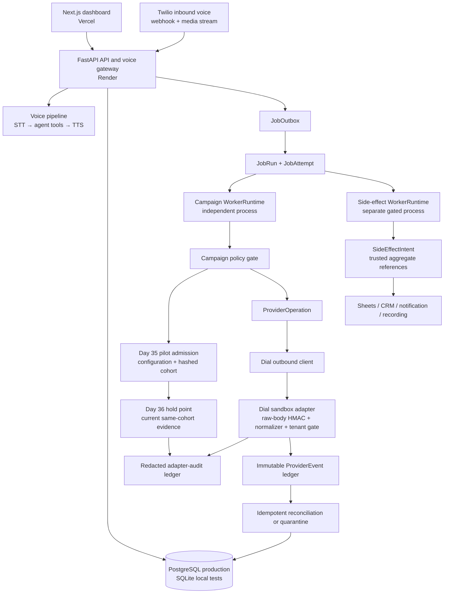
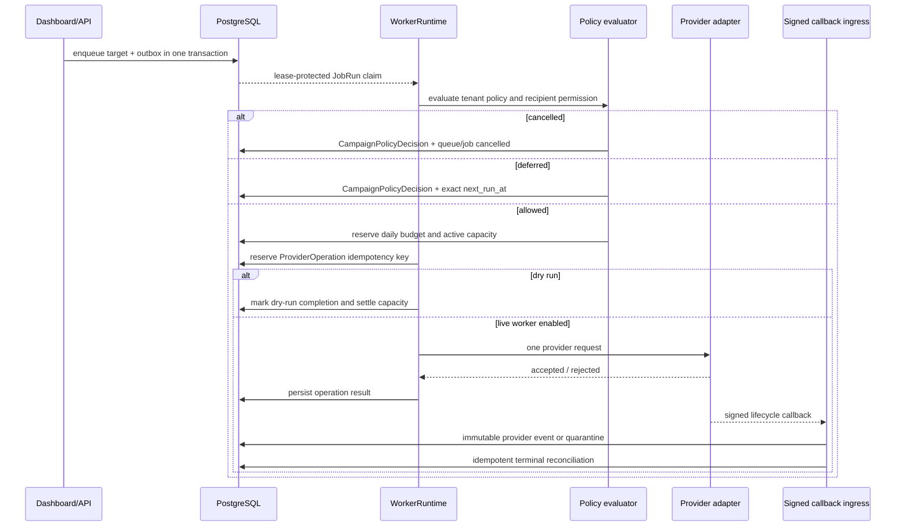
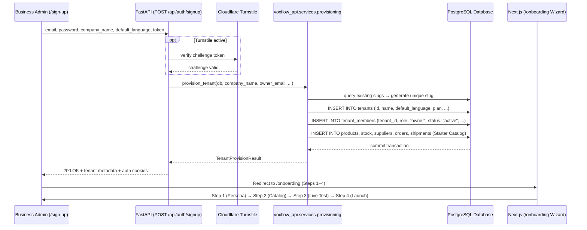
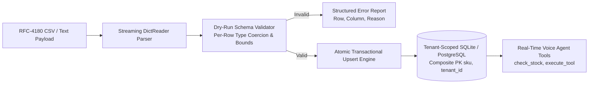
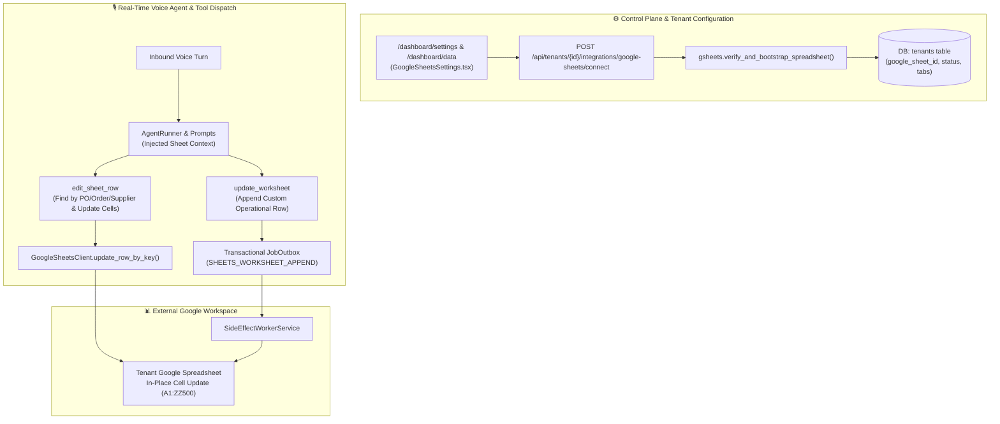
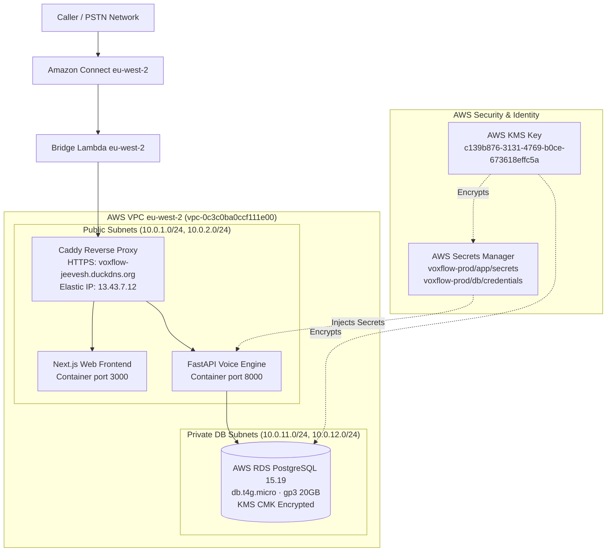

# VoxFlow Architecture

**Last updated:** 2026-09-05  
**Current milestone:** **Phase 1 Funded AWS Data Infrastructure Foundation complete.** 567 backend tests passing, 31 compiled frontend routes, AWS RDS PostgreSQL 15.19 (gp3 KMS encrypted), EC2 `t3.small` compute running Docker Compose (`caddy`, `api`, `web`) with automated TLS on `https://voxflow-jeevesh.duckdns.org`, AWS Secrets Manager (32 app keys + DB credentials) encrypted with customer-managed KMS key, 100% data parity migrated from Supabase, automated backups with 7-day PITR, superadmin governance (`/superadmin`), and Oracle ARM VM retained as standby. Comprehensive day-by-day implementation tracking is recorded in [`DAY_TRACKER.md`](DAY_TRACKER.md).
**Operating mode:** Inbound voice, self-serve tenant onboarding, streaming CSV ingestion engine, multi-tenant Google Sheets mirroring, live voice agent sheet editing, superadmin management, and public status reporting are deployed. Campaign dispatch and operational side-effect workers are independently safe-staged; Day 35 admission and Day 36 current-version evidence are both fail-closed with an empty tenant allow-list.


## 1. System boundaries

VoxFlow separates the latency-sensitive inbound voice path from durable operational work. FastAPI receives web/API requests and persists intent. Durable workers claim lease-protected jobs from the database and execute bounded units of background work. Campaign provider calls are not performed inside the campaign HTTP request transaction. The stack is containerized and deployed natively on AWS London `eu-west-2` (EC2 t3.small + RDS PostgreSQL 15.19 via Caddy auto-TLS reverse proxy), with Oracle Cloud ARM VM maintained as a live standby fallback.



| Boundary | Owner | Rule |
|---|---|---|
| Inbound voice | FastAPI voice pipeline | Preserve per-call latency; never wait on campaign jobs or outbox relays. |
| Command/control plane | FastAPI routes | Validate and persist tenant-scoped intent; do not create an outbound provider side effect inline. |
| Durable execution | `WorkerRuntime` | Claim only leased jobs, use conditional transitions, retry only typed transient errors. |
| Provider side effect | `ProviderOperation` | One idempotency key owns one provider request; retries reconcile rather than re-dial. |
| Normalized provider callback | `provider_callbacks.py` + `provider_events.py` | Verify generic timestamp/signature, derive tenant from stored operation, deduplicate immutable events, and quarantine unknown IDs. |
| Dial sandbox callback | `dial_callbacks.py` + `integrations/dial_callbacks.py` | Fail closed unless sandbox adapter/secret/allow-list are explicit; verify Dial raw-body HMAC, normalize documented outbound call events, audit safely, then hand off to Day 32. |
| Campaign permission | `campaign_policy.py` + `pilot_readiness.py` | Fail closed before provider intent: policy, consent, opt-out, explicit pilot tenant/configuration/cohort/expiry/coverage, timing, budget, and capacity. |
| Operational side effects | `side_effects.py` + `side_effect_worker_service.py` | Persist intent/outbox with a trusted aggregate; execute only from a separate feature-gated, tenant-scoped worker. |
| Pilot readiness | `pilot_readiness.py` + read-only route | Freeze metric definitions, show redacted cohort/coverage/expiry/rollback evidence, and keep all approval/activation operations outside HTTP. |
| Pilot operations evidence | `pilot_operations.py` + read-only route | Build aggregate preflight/hold-point evidence, require fresh same-cohort human review for the exact pilot version, and fail close on missing, stale, paused, blocked, rollback-requested, or version-mismatched evidence. |
| Operator visibility | Job health and analytics dashboard | Show tenant-owned counts and redacted audit/read models only; no activation control. |

## 2. Runtime components

### Frontend

`apps/web` is a Next.js 16.3.1 application deployed on Vercel. It uses TypeScript, Tailwind CSS, and SWR. The tenant context is passed to campaign lists, queue views, run/stage actions, health, and recent job reads. The campaigns page visualizes staged rollout state, durable job health, queued targets, and policy cancellations.

### FastAPI backend

`apps/api/voxflow_api` provides synchronous and asynchronous SQLAlchemy paths, inbound voice routes, dashboard APIs, campaign APIs, and job-health read models. The backend runs on Render in the deployed environment and supports SQLite for deterministic local tests.

### Durable job subsystem

The Day 25–34 subsystem lives in `apps/api/voxflow_api/jobs/`.

| Component | Responsibility |
|---|---|
| `enqueue.py` | Atomically persists campaign target intent and outbox event. |
| `outbox.py` | Leases and relays unprocessed transactional outbox events. |
| `repository.py` | Atomic claim, lease extension, success, retry, cancel, dead-letter, and recovery transitions. |
| `worker.py` | Bounded polling runtime, typed outcomes, backoff, graceful drain, and stale-worker protection. |
| `campaign_worker_service.py` | Standalone campaign worker entry point with global gate and canary tenant filter. |
| `campaign_dispatch.py` | Campaign target handler: policy, capacity, dry run, provider-operation reservation, and no-redial behavior. |
| `provider_operations.py` | Durable idempotency reservation and provider operation updates. |
| `reconciliation.py` | Applies provider terminal outcomes back to job/campaign state. |
| `provider_events.py` | Applies already-authenticated provider events, preserves event history, prevents terminal regression, and quarantines unknown provider call IDs. |
| `provider_adapter_audits.py` | Stores redacted, idempotent verification/normalization/rollout receipts for provider-specific adapters. |
| `campaign_policy.py` | Tenant policy evaluation, consent/opt-out enforcement, reservations, and immutable audit records. |
| `side_effects.py` | Typed effect constants plus sync/async transactional enqueue and redacted intent transitions. |
| `side_effect_worker_service.py` | Standalone Sheets/email/CRM/notification/recording handler registry with independent feature, tenant, and dry-run gates. |

## 3. Campaign dispatch lifecycle



A `requested` provider operation with unknown acceptance is retried through reconciliation, not by making a second provider request. An `accepted` operation waits for a callback/reconciliation terminal result. Terminal outcomes settle active capacity; a pre-request policy deferral or lease loss releases unused capacity and budget reservation.

## 4. Self-serve SaaS provisioning & tenant lifecycle

Day 44 unifies tenant creation, member role mapping, and initial catalog population into a centralized provisioning service (`voxflow_api.services.provisioning`). The public signup route (`POST /api/auth/signup`) and internal CLI (`scripts/onboard_tenant.py`) share this single source of truth.



| Lifecycle Component | Architecture Role | Security & Isolation Guarantee |
|---|---|---|
| `sanitize_slug()` & `generate_unique_tenant_slug()` | Deterministic URL/Tenant ID formatting | Automatic deduplication (`acme-logistics`, `acme-logistics-2`) prevents primary key collisions. |
| `provision_tenant()` | Transactional multi-table provisioning | Atomic creation of Tenant, Owner Member, Phone Mapping, and Seed Catalog in a single DB transaction. |
| `POST /api/auth/signup` | Public HTTP SaaS registration gateway | Bot-protected via optional Turnstile; maps requester to `ROLE_OWNER` with zero-trust hashed email verification. |
| `/onboarding` (Next.js 16) | 4-step interactive onboarding wizard | Step 1 (Agent Persona) $\rightarrow$ Step 2 (Catalog Stats) $\rightarrow$ Step 3 (Live Simulator) $\rightarrow$ Step 4 (Dashboard). |

## 5. Provider callback lifecycle

Day 32 exposes `POST /api/provider-callbacks/events`, a normalized callback ingress for an existing provider operation. With signature validation enabled, the route requires a current timestamp and HMAC-SHA256 signature over the raw body. The endpoint fails closed with `503` when no callback secret is configured, which is the deployed default until a provider-specific sandbox adapter is certified.

| Incoming condition | Durable response |
|---|---|
| Valid new event for known operation | Append `provider_events` record and apply only the allowed lifecycle transition. |
| Exact event replay | Return idempotent success with no new event, counter, job, or provider request. |
| Unknown call ID | Append `provider_callback_quarantines` record with no tenant mutation. |
| Late event after terminal operation | Retain a marked event but do not reopen queue/job/counters. |
| Terminal success/failure | Reconcile queue/campaign/capacity and terminal durable job once. |

Day 33 adds the Dial-specific adapter at `POST /api/provider-callbacks/dial/events`, but it is deployed in a certification-only posture. It parses `X-Dial-Signature: t=<unix-seconds>,v1=<hex-hmac>`, verifies HMAC-SHA256 over `timestamp + "." + raw body`, accepts only a configured current/previous secret overlap, and bounds replay age. It maps only documented outbound `call.status_changed` and `call.ended` events into the Day 32 neutral lifecycle; signed `webhook.ping` is acknowledged without creating a business event. The route cannot apply an event unless `DIAL_CALLBACK_ADAPTER_ENABLED=true`, sandbox mode remains true, a secret exists, and the resolved tenant is explicitly allow-listed. No raw provider callback payload, signature, secret, transcript, phone number, or job payload is rendered in analytics or stored in the adapter audit ledger. [1] [2] [3]

## 6. Operational side-effect lifecycle

Day 34 moves API-process Sheets retry, periodic email scheduling, direct agent notification delivery, fire-and-forget CRM posting, generic worksheet writes, and recording follow-up into the durable job contract. `SideEffectIntent` stores only a type, trusted aggregate reference, idempotency key, hash, and bounded result state. It never stores a raw external payload.

| Source path | Atomic write | Typed job | Worker-owned behavior |
|---|---|---|---|
| Call outcome | `WorksheetLog` + intent/outbox | `sheets.call_outcome.append` | Reads the stored canonical row and mirrors it only after approval. |
| Email summary | `CommunicationLog` + `WorksheetLog` + intent/outbox | `email.summarization.scan`, `sheets.email_summary.append` | Fetches/summarizes only in the worker and mirrors stored summary rows. |
| CRM event | Order, appointment, or worksheet escalation/outcome + intent/outbox | `crm.webhook.sync` | Derives event payload from the trusted aggregate. |
| Notification | `CommunicationLog(status=queued)` + intent/outbox | `notification.dispatch` | Reads a stored communication record; voice/API code never calls Twilio inline. |
| Recording callback | `Call.recording_url` + intent/outbox | `recording.retrieve` | Performs no media request until a future separately approved non-dry-run storage design exists. |

The worker builds only if `DURABLE_SIDE_EFFECTS_WORKER_ENABLED=true` **and** an explicit tenant allow-list exists. In Day 34 production defaults it is disabled. If it is later admitted in dry-run, a claimed intent receives a bounded `dry_run` result and no integration client is invoked. Retryable transport faults retain `retry_scheduled`; malformed aggregate, missing configuration, or unsupported channels retain bounded terminal evidence. The existing `WorkerRuntime` owns lease renewal, retries, stale-worker recovery, and attempt history.

## 7. Tenant policy and auditable cancellation

The policy gate runs before `ProviderOperation` reservation. A dispatch target must satisfy all conditions below.

| Check | Data source | Failed outcome |
|---|---|---|
| Tenant policy exists and is enabled | `tenant_campaign_policies` | `tenant_policy_missing` or `tenant_policy_disabled` cancellation |
| Campaign is active/running | `outbound_campaigns` | `campaign_not_active` cancellation |
| Consent is granted | `recipient_campaign_preferences` | `consent_not_granted` cancellation |
| Recipient is not opted out | `recipient_campaign_preferences` | `recipient_opted_out` cancellation |
| Consent purpose covers dispatch | Recipient preference + campaign type | `consent_purpose_mismatch` cancellation |
| Calling window is open in tenant timezone | Tenant policy | `outside_calling_window` exact deferral |
| Daily budget remains | `tenant_daily_dispatch_usage` | `daily_call_budget_exhausted` deferral |
| Active tenant capacity remains | Same usage record | `tenant_concurrency_limited` deferral |
| Pilot tenant explicitly approved | `PILOT_READINESS_APPROVED_TENANTS` | `pilot_tenant_not_approved` cancellation |
| Written pilot is approved/unexpired/staffed/micro-capped | `pilot_configurations` | Pilot configuration/expiry/coverage/capacity cancellation |
| Recipient belongs to reviewed fixed cohort | `pilot_cohort_members` SHA-256 hash | `pilot_cohort_mismatch` cancellation |
| Current same-cohort hold evidence exists | `pilot_operational_evidence` | Missing/stale/paused/blocked/rollback/version-mismatched hold cancellation |

Every policy evaluation appends a `campaign_policy_decisions` record.
 The operator endpoint returns decision, reason code, timestamp, and next eligible time, but does not expose raw evidence JSON. Policy cancellations map to terminal durable `cancelled` jobs rather than dead letters.

## 8. Data model

The core business schema remains tenant scoped. Durable dispatch adds the following tables.

| Table | Purpose |
|---|---|
| `job_runs` | Durable queued work, state, lease, retry timing, idempotency key, and terminal outcome. |
| `job_outbox` | Transactional events persisted with domain changes and published by a relay. |
| `job_attempts` | Immutable execution-attempt evidence. |
| `provider_operations` | Provider-side idempotency and reconciliation boundary. |
| `provider_events` | Append-only signed callback evidence with provider-event idempotency and application/anomaly state. |
| `provider_callback_quarantines` | Trusted-but-unmatched callback evidence that deliberately has no tenant link. |
| `provider_callback_adapter_audits` | Redacted immutable Dial-adapter verification, normalization, and tenant-rollout receipts. |
| `tenant_campaign_policies` | Tenant timezone, calling window, quota, capacity, and enablement. |
| `recipient_campaign_preferences` | Consent, purpose, opt-out, and provenance per tenant/phone. |
| `tenant_daily_dispatch_usage` | Tenant-local daily reservation and active-dispatch counters. |
| `campaign_dispatch_reservations` | One capacity reservation per job with active/released/settled lifecycle. |
| `campaign_policy_decisions` | Immutable Day 30 policy audit evidence. |
| `side_effect_intents` | Day 34 append-only tenant effect owner with a one-to-one durable job, aggregate reference, idempotency key, hash, redacted result, and status. |
| `pilot_configurations` | Versioned one-tenant readiness contract: cohort reference/count, IANA window, micro-capacity, expiry, named coverage, approver, and metric contract. |
| `pilot_cohort_members` | Reviewed cohort membership represented only by tenant-scoped SHA-256 recipient hashes and consent-evidence references. |
| `pilot_security_incidents` | Bounded confirmed security findings that make the pilot’s zero-incident objective measurable rather than assumed. |
| `pilot_operational_evidence` | Immutable aggregate-only preflight, hold-point, pause, and rollback evidence, uniquely scoped by tenant/pilot/version/evidence key. |

Production migrations are ordered as `003_durable_job_ledger.sql`, `004_outbox_relay_state.sql`, `005_campaign_policy_controls.sql`, `006_provider_callback_lifecycle.sql`, `007_dial_sandbox_callback_adapter.sql`, `008_typed_durable_side_effect_jobs.sql`, `009_controlled_pilot_readiness.sql`, then `010_pilot_operations_evidence.sql`.

## 9. Production safety and rollout

The deployed backend remains in a non-executing campaign posture:

```text
DURABLE_CAMPAIGN_WORKER_ENABLED=false
PILOT_READINESS_ENFORCED=true
PILOT_READINESS_APPROVED_TENANTS=(intentionally empty)
PILOT_OPERATIONS_EVIDENCE_ENFORCED=true
PROVIDER_CALLBACK_VALIDATE_SIGNATURE=true
PROVIDER_CALLBACK_SHARED_SECRET=(intentionally unset)
DIAL_CALLBACK_ADAPTER_ENABLED=false
DIAL_CALLBACK_SANDBOX_MODE=true
DIAL_CALLBACK_ALLOWED_TENANTS=(intentionally empty)
DIAL_CALLBACK_SIGNING_SECRETS=(intentionally unset)
DURABLE_SIDE_EFFECTS_WORKER_ENABLED=false
DURABLE_SIDE_EFFECTS_DRY_RUN=true
DURABLE_SIDE_EFFECTS_ALLOWED_TENANTS=(intentionally empty)
activation_mode=staged
canary_allowed=false
dry_run=true
```

These settings are a deliberate layered control, not a missing feature. An internal canary must use a dedicated worker process, explicit tenant allow-list, dry-run evidence, tenant policy configuration, consented test target, concurrency one, monitoring, and a rollback owner. The dashboard’s `Launch Campaign` control does not bypass the worker gate or invoke the provider inline.

## 10. Bulk Company Data Ingestion Subsystem

The bulk ingestion subsystem lives in `apps/api/voxflow_api/services/data_ingestion.py` and `routes/data.py`.



- **Streaming DictReader**: Memory-bounded line-by-line processing supporting large product and stock matrices.
- **5 Core Model Schemas**: Products, Stock, Suppliers, Purchase Orders, and Shipments with strict E.164 phone sanitization, decimal MRP coercion, and JSON item parsing.
- **Pre-Flight Validation**: `POST /api/data/{entity}/validate` dry-runs all validations before mutating tables.
- **Composite Primary Keys & Multi-Tenant Isolation**: Enforces tenant scoping at the DB composite key layer (`Product.sku, Product.tenant_id`) preventing cross-tenant leakage.
- **Real-Time Agent Queryability**: Imported catalog items and stock levels are immediately available to voice agent lookup tools.

## 11. Engineering quality gates

| Surface | Command | Verified Outcome |
|---|---|---|
| Backend lint | `cd apps/api && ruff check voxflow_api tests` | Clean (0 errors) |
| Backend tests | `cd apps/api && pytest -q` | **351 passed** (in ~80s) |
| Latency benchmark harness | `python3 scripts/benchmark_latency.py` | Verified P50/P90/P99 latency distributions |
| Frontend lint | `npm run lint --workspace=apps/web` | Clean (0 errors) |
| Frontend production build | `cd apps/web && npx next build --webpack` | **25 compiled routes** |
| Live job posture | `GET /api/jobs/health?tenant_id=varun` | Staged / safe |

At the current delivery point, the backend suite has **411 passing tests**, API lint is clean, and the frontend production build generates 25 routes cleanly. GitHub CI validates API lint, API test, and web lint/build on every `main` delivery. Detailed historical day-by-day logs are available in [`DAY_TRACKER.md`](DAY_TRACKER.md).

## 11. Self-Serve Per-Tenant Google Sheets Integration & Live Voice Agent Row Editing

The multi-tenant Google Sheets subsystem (`apps/api/voxflow_api/integrations/gsheets.py` & `routes/integrations.py`) allows each enterprise workspace to connect its own Google Spreadsheet:



| Component | Responsibility |
|---|---|
| `integrations/gsheets.py` | Google Sheets API v4 client. Resolves service account OAuth2 tokens, executes `append_row`, `read_sheet_rows`, `update_row_by_key`, and handles auto-provisioning of missing header columns. |
| `routes/integrations.py` | Tenant-scoped REST API for reading configuration, connecting with URL parsing, executing preflight live read/write latency diagnostics, and disconnecting. |
| `agent/tools.py` (`edit_sheet_row`) | Voice agent tool allowing the LLM to search for a row by a key (e.g. `PO Number` = `PO-1002`) and update specific cells in place, while recording local audit entries in `worksheet_logs`. |
| `agent/prompts.py` | Dynamically injects the workspace's connected spreadsheet title and editing capabilities into the system prompt context. |
| `jobs/side_effect_worker_service.py` | Resolves `tenant.google_sheet_id` dynamically for background retry jobs. |

## References

- `DAY_TRACKER.md` (Master Day-Wise Implementation Tracker)
- `apps/api/voxflow_api/integrations/gsheets.py`
- `apps/api/voxflow_api/routes/integrations.py`
- `apps/api/voxflow_api/services/data_ingestion.py`
- `apps/api/voxflow_api/routes/data.py`


- `DAY_TRACKER.md` (Master Day-Wise Implementation Tracker)
- `BENCHMARK_REPORT.md` (Reproducible Latency & TTFT Benchmark Telemetry)
- `apps/api/voxflow_api/benchmarks/` (Modular Latency & Percentile Timing Engine)
- `deploy/ORACLE_DEPLOY.md` (Oracle Cloud Always-Free ARM Deployment Runbook)
- `deploy/Caddyfile` & `deploy/docker-compose.prod.yml`
- `apps/api/voxflow_api/jobs/`
- `apps/api/voxflow_api/db.py`
- `migrations/001_rls_policies.sql` through `migrations/010_pilot_operations_evidence.sql`
- `migrations/004_outbox_relay_state.sql`
- `migrations/005_campaign_policy_controls.sql`
- `migrations/006_provider_callback_lifecycle.sql`
- `migrations/007_dial_sandbox_callback_adapter.sql`
- `migrations/008_typed_durable_side_effect_jobs.sql`
- `migrations/009_controlled_pilot_readiness.sql`
- `migrations/010_pilot_operations_evidence.sql`
- `apps/api/voxflow_api/pilot_readiness.py`
- `apps/api/voxflow_api/pilot_operations.py`
- `apps/api/voxflow_api/routes/pilot_readiness.py`
- `apps/api/voxflow_api/routes/pilot_operations.py`
- `railway.json`
- `apps/api/voxflow_api/jobs/side_effects.py`
- `apps/api/voxflow_api/jobs/side_effect_worker_service.py`
- `apps/api/voxflow_api/integrations/dial_callbacks.py`
- `apps/api/voxflow_api/routes/dial_callbacks.py`
- `apps/web/src/app/dashboard/analytics/page.tsx`
- `apps/web/src/components/CosmicJourney.tsx`
- `apps/web/src/components/AcousticBlackHoleCanvas.tsx`
- `apps/web/src/components/HeroChoreography.tsx`
- `apps/web/public/images/journey/*.webp`

## 10. Landing Page Architecture — Cosmic Journey

The Vercel-deployed Next.js landing page (`apps/web/src/app/page.tsx`) implements a **pinned 5-keyframe cosmic journey** in the hero section. It reuses the existing `HeroChoreography` / `--hero-progress` scroll bus (GSAP ScrollTrigger scrub, 500vh pin) rather than introducing new scroll machinery.

### 10.1 Journey Component Structure

| Component | Role |
|---|---|
| `CosmicJourney.tsx` | Zero-JS server component: 5 absolute `inset-0` layers (`journey-kf-2` through `journey-kf-5`), streak overlay (`journey-streaks`), scrim (`journey-scrim`). Each layer uses `background-image: url(...), gradient(...)` so missing images degrade to mood colour. |
| `AcousticBlackHoleCanvas.tsx` | Existing Three.js WebGL canvas (KF1). Retained as-is; its container `.hero-blackhole-layer` now paints `01-black-hole.webp` as a poster fallback behind the canvas. |
| `HeroChoreography.tsx` | Unchanged — publishes `--hero-progress` (0→1) on `#hero-stage` via GSAP ScrollTrigger scrub. The journey reads this same variable via `calc(clamp(...))` in CSS. |
| `page.tsx` | Mounts `CosmicJourney` immediately after `.hero-blackhole-layer` (DOM paint order = z-order, both `z-index:0`). Replaces two `ScrollCharReveal` punchlines with three `hero-punchline-j1/j2/j3` `<p>` elements. |

### 10.2 Scroll Bands (Progress 0→1)

| Band | Keyframe | Opacity Curve | Copy |
|---|---|---|---|
| 0.00–0.16 | KF1 Black Hole | `1 → 0` (0.10–0.18) | — |
| 0.16–0.34 | KF2 Starfield | `0 → 1 → 0` (0.10–0.28 in, 0.28–0.34 out) | "Out here, signals go quiet." |
| 0.34–0.52 | KF3 Solar System | `0 → 1 → 0` (0.28–0.46 in, 0.46–0.52 out) | "A signal, still moving." |
| 0.52–0.70 | KF4 Telescope | `0 → 1 → 0` (0.46–0.64 in, 0.64–0.70 out) + streak peak 0.60 | "Someone's listening now." |
| 0.70–0.76 | KF5 Earth (arrive) | `0 → 1` (0.64–0.72), holds 1.0 | *(empty — payoff breath)* |
| 0.76–1.00 | Earth (sticky) | `1` (frozen) | "We closed the black hole on the dispatch line." (existing `hero-copy` dock) + console dock |

### 10.3 Motion Details

- **Crossfades:** Pure CSS `opacity: calc(clamp(...) * clamp(...))` — bidirectional, no latch.
- **Depth push:** Each layer `transform: scale(1.xx → 1.0)` via `calc(clamp(...))` — subtle parallax without layered exports.
- **KF4 streak sweep:** Two counter-drifting `repeating-linear-gradient` rakes with `mask-image` radial fade — zero asset cost, `opacity 0→0.5→0` at 0.48–0.62.
- **Scrim:** `linear-gradient` darkening Earth left side, ramps `0→1` from 0.72 to keep headline legible.

### 10.4 Fallbacks

| Condition | Behavior |
|---|---|
| `prefers-reduced-motion: reduce` | KF2–KF4 + streaks + journey lines `display: none`; KF5 Earth + scrim `opacity: 1`; black hole `opacity: 0`. Resolves to static Earth plate behind headline. |
| `max-width: 1023px` (mobile/tablet) | Same as reduced-motion — the pinned choreography only runs on desktop (`@media (min-width: 1024px)`). |

### 10.5 Asset Pipeline

| Frame | Source | Dimensions | Tool | Size |
|---|---|---|---|---|
| KF1 | Existing WebGL canvas + `01-black-hole.webp` | 1280×720 | — | 99KB |
| KF2 | Higgsfield `nano_banana_pro` | 2752×1536 → 2048w | `sips` + `cwebp -q 80` | 107KB |
| KF3 | Higgsfield `nano_banana_pro` | 2752×1536 → 2048w | `sips` + `cwebp -q 80` | 68KB |
| KF4 | Higgsfield `nano_banana_pro` | 2752×1536 → 2048w | `sips` + `cwebp -q 80` | 138KB |
| KF5 | Higgsfield `nano_banana_pro` | 2752×1536 → 2048w | `sips` + `cwebp -q 80` | 135KB |

Total: **556KB**. Budget: 10 Higgsfield credits → 8 spent (4×2), 2 spare for one retry. All 4 generated first-take.

### 10.6 Verification

| Check | Method | Result |
|---|---|---|
| Opacity curves | Playwright forced `--hero-progress` probes (0, 0.24, 0.42, 0.60, 0.72, 0.88) | Matched spec within 0.01 |
| Real scroll | `window.scrollTo(maxScroll * p)` + 800ms wait | GSAP `scrub` reproduced identical `hp` values |
| Earth bleed | Scroll past hero (heroH 4000, vh 800) | `hero.bottom=0`, `kf5=1`, `sticky=sticky`, trust strip below solid — no bleed |
| Reduced motion | CDP `Emulation.setEmulatedMedia prefers-reduced-motion:reduce` before nav | `kf2 display:none`, `kf5 1`, `j1 display:none`, `copy 1` |
| Mobile 390px | Playwright `is_mobile: true` viewport | `heroH auto`, `kf5 1`, `j1 display:none`, `bh 0` |
| Build | `npm run build --workspace=apps/web` | Clean; all 5 WebPs `200 image/webp`; SSR html contains journey markers |

## 11. AWS Native Cloud Infrastructure (Phase 1)

Phase 1 migrates VoxFlow from the Phase 0 bootstrap setup (Oracle VM + Supabase) onto an integrated AWS architecture in London (`eu-west-2`), eliminating WAN cross-cloud network hops between Amazon Connect telephony and backend compute.

### 11.1 Infrastructure Topology



### 11.2 Key Architectural Decisions

1. **Compute Sizing & Budget Optimization**:
   - Initial roadmap proposed ECS Fargate + ALB + NAT Gateway (~$80/mo). To stay strictly within the founder's credit boundary ($142), we provisioned a lean, production-grade EC2 `t3.small` instance running Docker Compose (`caddy`, `api`, `web`) with 2GB swap and automated Let's Encrypt TLS (~$16/mo total).
   - This delivers identical security isolation and zero cross-cloud latency at <20% of the cost.
2. **Database Isolation & Encryption**:
   - AWS RDS PostgreSQL 15.19 is deployed in isolated private database subnets with no public internet route.
   - Ingress security group strictly authorizes inbound port 5432 from the EC2 security group only.
   - Storage is encrypted at rest using an AWS KMS Customer Managed Key (CMK).
3. **Secrets Management**:
   - All runtime application credentials (32 keys) and database passwords are stored in AWS Secrets Manager (`voxflow-prod/app/secrets`).
   - Zero sensitive `.env` files or credentials exist in version control.
4. **Disaster Recovery & Redundancy**:
   - Automated daily snapshots with 7-day Point-in-Time Recovery (PITR).
   - Validated manual restore snapshot drill (`voxflow-prod-postgres-manual-drill-1788632231`).
   - Oracle Cloud ARM VM is maintained as a live standby replica during the initial billing cycle per Phase 1 DoD.

[1] [Dial Webhooks](https://docs.getdial.ai/documentation/platform/webhooks.md)
[2] [Dial `call.status_changed`](https://docs.getdial.ai/api-reference/events/call-status-changed.md)
[3] [Dial `call.ended`](https://docs.getdial.ai/api-reference/events/call-ended.md)
