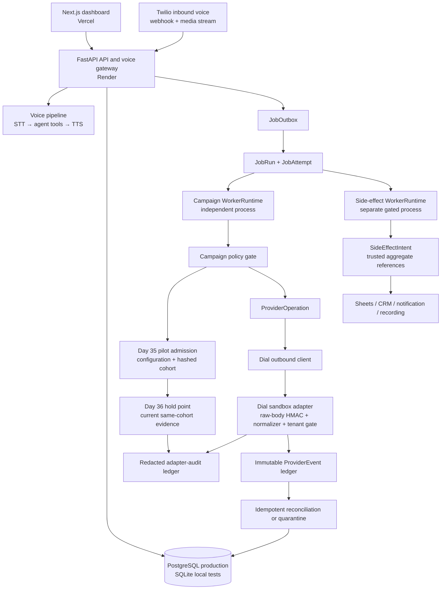
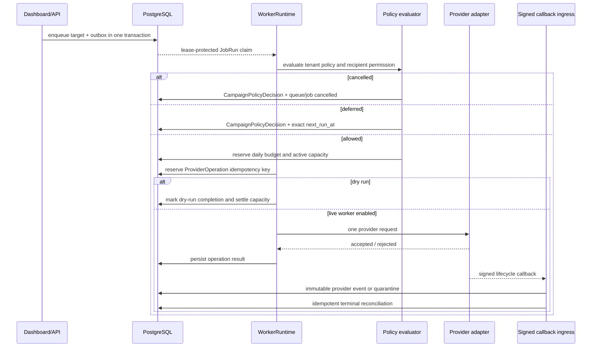

# VoxFlow Architecture

**Last updated:** 2026-08-22  
**Current milestone:** **Phase 9 Infrastructure, Resilience & UI Overhaul complete.** 266 backend tests passing, 23 compiled frontend routes, Oracle Cloud Always-Free ARM VM containerized architecture with Caddy auto-TLS reverse proxy, and bilingual LLM provider resilience fallbacks. Comprehensive day-by-day implementation tracking is recorded in [`DAY_TRACKER.md`](DAY_TRACKER.md).  
**Operating mode:** Inbound voice and dashboard functions are deployed. Campaign dispatch and operational side-effect workers are independently safe-staged; Day 35 admission and Day 36 current-version evidence are both fail-closed with an empty tenant allow-list.

## 1. System boundaries

VoxFlow separates the latency-sensitive inbound voice path from durable operational work. FastAPI receives web/API requests and persists intent. Durable workers claim lease-protected jobs from the database and execute bounded units of background work. Campaign provider calls are not performed inside the campaign HTTP request transaction. The stack is containerized and deployable on Oracle Cloud ARM VMs (via Caddy auto-TLS reverse proxy) as well as managed cloud hosts (Render/Vercel/Fly).



| Boundary | Owner | Rule |
|---|---|---|
| Inbound voice | FastAPI voice pipeline | Preserve per-call latency; never wait on campaign jobs or outbox relays. |
| Command/control plane | FastAPI routes | Validate and persist tenant-scoped intent; do not create an outbound provider side effect inline. |
| Durable execution | `WorkerRuntime` | Claim only leased jobs, use conditional transitions, retry only typed transient errors. |
| Provider side effect | `ProviderOperation` | One idempotency key owns one provider request; retries reconcile rather than re-dial. |
| Normalized provider callback | `provider_callbacks.py` + `provider_events.py` | Verify generic timestamp/signature, derive tenant from stored operation, deduplicate immutable events, and quarantine unknown IDs. |
| Dial sandbox callback | `dial_callbacks.py` + `integrations/dial_callbacks.py` | Fail closed unless sandbox adapter/secret/allow-list are explicit; verify Dial raw-body HMAC, normalize documented outbound call events, audit safely, then hand off to Day 32. |
| Campaign permission | `campaign_policy.py` + `pilot_readiness.py` | Fail closed before provider intent: policy, consent, opt-out, explicit pilot tenant/configuration/cohort/expiry/coverage, timing, budget, and capacity. |
| Operational side effects | `side_effects.py` + `side_effect_worker_service.py` | Persist intent/outbox with a trusted aggregate; execute only from a separate feature-gated, tenant-scoped worker. |
| Pilot readiness | `pilot_readiness.py` + read-only route | Freeze metric definitions, show redacted cohort/coverage/expiry/rollback evidence, and keep all approval/activation operations outside HTTP. |
| Pilot operations evidence | `pilot_operations.py` + read-only route | Build aggregate preflight/hold-point evidence, require fresh same-cohort human review for the exact pilot version, and fail close on missing, stale, paused, blocked, rollback-requested, or version-mismatched evidence. |
| Operator visibility | Job health and analytics dashboard | Show tenant-owned counts and redacted audit/read models only; no activation control. |

## 2. Runtime components

### Frontend

`apps/web` is a Next.js 16.3.1 application deployed on Vercel. It uses TypeScript, Tailwind CSS, and SWR. The tenant context is passed to campaign lists, queue views, run/stage actions, health, and recent job reads. The campaigns page visualizes staged rollout state, durable job health, queued targets, and policy cancellations.

### FastAPI backend

`apps/api/voxflow_api` provides synchronous and asynchronous SQLAlchemy paths, inbound voice routes, dashboard APIs, campaign APIs, and job-health read models. The backend runs on Render in the deployed environment and supports SQLite for deterministic local tests.

### Durable job subsystem

The Day 25–34 subsystem lives in `apps/api/voxflow_api/jobs/`.

| Component | Responsibility |
|---|---|
| `enqueue.py` | Atomically persists campaign target intent and outbox event. |
| `outbox.py` | Leases and relays unprocessed transactional outbox events. |
| `repository.py` | Atomic claim, lease extension, success, retry, cancel, dead-letter, and recovery transitions. |
| `worker.py` | Bounded polling runtime, typed outcomes, backoff, graceful drain, and stale-worker protection. |
| `campaign_worker_service.py` | Standalone campaign worker entry point with global gate and canary tenant filter. |
| `campaign_dispatch.py` | Campaign target handler: policy, capacity, dry run, provider-operation reservation, and no-redial behavior. |
| `provider_operations.py` | Durable idempotency reservation and provider operation updates. |
| `reconciliation.py` | Applies provider terminal outcomes back to job/campaign state. |
| `provider_events.py` | Applies already-authenticated provider events, preserves event history, prevents terminal regression, and quarantines unknown provider call IDs. |
| `provider_adapter_audits.py` | Stores redacted, idempotent verification/normalization/rollout receipts for provider-specific adapters. |
| `campaign_policy.py` | Tenant policy evaluation, consent/opt-out enforcement, reservations, and immutable audit records. |
| `side_effects.py` | Typed effect constants plus sync/async transactional enqueue and redacted intent transitions. |
| `side_effect_worker_service.py` | Standalone Sheets/email/CRM/notification/recording handler registry with independent feature, tenant, and dry-run gates. |

## 3. Campaign dispatch lifecycle



A `requested` provider operation with unknown acceptance is retried through reconciliation, not by making a second provider request. An `accepted` operation waits for a callback/reconciliation terminal result. Terminal outcomes settle active capacity; a pre-request policy deferral or lease loss releases unused capacity and budget reservation.

## 4. Provider callback lifecycle

Day 32 exposes `POST /api/provider-callbacks/events`, a normalized callback ingress for an existing provider operation. With signature validation enabled, the route requires a current timestamp and HMAC-SHA256 signature over the raw body. The endpoint fails closed with `503` when no callback secret is configured, which is the deployed default until a provider-specific sandbox adapter is certified.

| Incoming condition | Durable response |
|---|---|
| Valid new event for known operation | Append `provider_events` record and apply only the allowed lifecycle transition. |
| Exact event replay | Return idempotent success with no new event, counter, job, or provider request. |
| Unknown call ID | Append `provider_callback_quarantines` record with no tenant mutation. |
| Late event after terminal operation | Retain a marked event but do not reopen queue/job/counters. |
| Terminal success/failure | Reconcile queue/campaign/capacity and terminal durable job once. |

Day 33 adds the Dial-specific adapter at `POST /api/provider-callbacks/dial/events`, but it is deployed in a certification-only posture. It parses `X-Dial-Signature: t=<unix-seconds>,v1=<hex-hmac>`, verifies HMAC-SHA256 over `timestamp + "." + raw body`, accepts only a configured current/previous secret overlap, and bounds replay age. It maps only documented outbound `call.status_changed` and `call.ended` events into the Day 32 neutral lifecycle; signed `webhook.ping` is acknowledged without creating a business event. The route cannot apply an event unless `DIAL_CALLBACK_ADAPTER_ENABLED=true`, sandbox mode remains true, a secret exists, and the resolved tenant is explicitly allow-listed. No raw provider callback payload, signature, secret, transcript, phone number, or job payload is rendered in analytics or stored in the adapter audit ledger. [1] [2] [3]

## 5. Operational side-effect lifecycle

Day 34 moves API-process Sheets retry, periodic email scheduling, direct agent notification delivery, fire-and-forget CRM posting, generic worksheet writes, and recording follow-up into the durable job contract. `SideEffectIntent` stores only a type, trusted aggregate reference, idempotency key, hash, and bounded result state. It never stores a raw external payload.

| Source path | Atomic write | Typed job | Worker-owned behavior |
|---|---|---|---|
| Call outcome | `WorksheetLog` + intent/outbox | `sheets.call_outcome.append` | Reads the stored canonical row and mirrors it only after approval. |
| Email summary | `CommunicationLog` + `WorksheetLog` + intent/outbox | `email.summarization.scan`, `sheets.email_summary.append` | Fetches/summarizes only in the worker and mirrors stored summary rows. |
| CRM event | Order, appointment, or worksheet escalation/outcome + intent/outbox | `crm.webhook.sync` | Derives event payload from the trusted aggregate. |
| Notification | `CommunicationLog(status=queued)` + intent/outbox | `notification.dispatch` | Reads a stored communication record; voice/API code never calls Twilio inline. |
| Recording callback | `Call.recording_url` + intent/outbox | `recording.retrieve` | Performs no media request until a future separately approved non-dry-run storage design exists. |

The worker builds only if `DURABLE_SIDE_EFFECTS_WORKER_ENABLED=true` **and** an explicit tenant allow-list exists. In Day 34 production defaults it is disabled. If it is later admitted in dry-run, a claimed intent receives a bounded `dry_run` result and no integration client is invoked. Retryable transport faults retain `retry_scheduled`; malformed aggregate, missing configuration, or unsupported channels retain bounded terminal evidence. The existing `WorkerRuntime` owns lease renewal, retries, stale-worker recovery, and attempt history.

## 6. Tenant policy and auditable cancellation

The policy gate runs before `ProviderOperation` reservation. A dispatch target must satisfy all conditions below.

| Check | Data source | Failed outcome |
|---|---|---|
| Tenant policy exists and is enabled | `tenant_campaign_policies` | `tenant_policy_missing` or `tenant_policy_disabled` cancellation |
| Campaign is active/running | `outbound_campaigns` | `campaign_not_active` cancellation |
| Consent is granted | `recipient_campaign_preferences` | `consent_not_granted` cancellation |
| Recipient is not opted out | `recipient_campaign_preferences` | `recipient_opted_out` cancellation |
| Consent purpose covers dispatch | Recipient preference + campaign type | `consent_purpose_mismatch` cancellation |
| Calling window is open in tenant timezone | Tenant policy | `outside_calling_window` exact deferral |
| Daily budget remains | `tenant_daily_dispatch_usage` | `daily_call_budget_exhausted` deferral |
| Active tenant capacity remains | Same usage record | `tenant_concurrency_limited` deferral |
| Pilot tenant explicitly approved | `PILOT_READINESS_APPROVED_TENANTS` | `pilot_tenant_not_approved` cancellation |
| Written pilot is approved/unexpired/staffed/micro-capped | `pilot_configurations` | Pilot configuration/expiry/coverage/capacity cancellation |
| Recipient belongs to reviewed fixed cohort | `pilot_cohort_members` SHA-256 hash | `pilot_cohort_mismatch` cancellation |
| Current same-cohort hold evidence exists | `pilot_operational_evidence` | Missing/stale/paused/blocked/rollback/version-mismatched hold cancellation |

Every policy evaluation appends a `campaign_policy_decisions` record.
 The operator endpoint returns decision, reason code, timestamp, and next eligible time, but does not expose raw evidence JSON. Policy cancellations map to terminal durable `cancelled` jobs rather than dead letters.

## 7. Data model

The core business schema remains tenant scoped. Durable dispatch adds the following tables.

| Table | Purpose |
|---|---|
| `job_runs` | Durable queued work, state, lease, retry timing, idempotency key, and terminal outcome. |
| `job_outbox` | Transactional events persisted with domain changes and published by a relay. |
| `job_attempts` | Immutable execution-attempt evidence. |
| `provider_operations` | Provider-side idempotency and reconciliation boundary. |
| `provider_events` | Append-only signed callback evidence with provider-event idempotency and application/anomaly state. |
| `provider_callback_quarantines` | Trusted-but-unmatched callback evidence that deliberately has no tenant link. |
| `provider_callback_adapter_audits` | Redacted immutable Dial-adapter verification, normalization, and tenant-rollout receipts. |
| `tenant_campaign_policies` | Tenant timezone, calling window, quota, capacity, and enablement. |
| `recipient_campaign_preferences` | Consent, purpose, opt-out, and provenance per tenant/phone. |
| `tenant_daily_dispatch_usage` | Tenant-local daily reservation and active-dispatch counters. |
| `campaign_dispatch_reservations` | One capacity reservation per job with active/released/settled lifecycle. |
| `campaign_policy_decisions` | Immutable Day 30 policy audit evidence. |
| `side_effect_intents` | Day 34 append-only tenant effect owner with a one-to-one durable job, aggregate reference, idempotency key, hash, redacted result, and status. |
| `pilot_configurations` | Versioned one-tenant readiness contract: cohort reference/count, IANA window, micro-capacity, expiry, named coverage, approver, and metric contract. |
| `pilot_cohort_members` | Reviewed cohort membership represented only by tenant-scoped SHA-256 recipient hashes and consent-evidence references. |
| `pilot_security_incidents` | Bounded confirmed security findings that make the pilot’s zero-incident objective measurable rather than assumed. |
| `pilot_operational_evidence` | Immutable aggregate-only preflight, hold-point, pause, and rollback evidence, uniquely scoped by tenant/pilot/version/evidence key. |

Production migrations are ordered as `003_durable_job_ledger.sql`, `004_outbox_relay_state.sql`, `005_campaign_policy_controls.sql`, `006_provider_callback_lifecycle.sql`, `007_dial_sandbox_callback_adapter.sql`, `008_typed_durable_side_effect_jobs.sql`, `009_controlled_pilot_readiness.sql`, then `010_pilot_operations_evidence.sql`.

## 8. Production safety and rollout

The deployed backend remains in a non-executing campaign posture:

```text
DURABLE_CAMPAIGN_WORKER_ENABLED=false
PILOT_READINESS_ENFORCED=true
PILOT_READINESS_APPROVED_TENANTS=(intentionally empty)
PILOT_OPERATIONS_EVIDENCE_ENFORCED=true
PROVIDER_CALLBACK_VALIDATE_SIGNATURE=true
PROVIDER_CALLBACK_SHARED_SECRET=(intentionally unset)
DIAL_CALLBACK_ADAPTER_ENABLED=false
DIAL_CALLBACK_SANDBOX_MODE=true
DIAL_CALLBACK_ALLOWED_TENANTS=(intentionally empty)
DIAL_CALLBACK_SIGNING_SECRETS=(intentionally unset)
DURABLE_SIDE_EFFECTS_WORKER_ENABLED=false
DURABLE_SIDE_EFFECTS_DRY_RUN=true
DURABLE_SIDE_EFFECTS_ALLOWED_TENANTS=(intentionally empty)
activation_mode=staged
canary_allowed=false
dry_run=true
```

These settings are a deliberate layered control, not a missing feature. An internal canary must use a dedicated worker process, explicit tenant allow-list, dry-run evidence, tenant policy configuration, consented test target, concurrency one, monitoring, and a rollback owner. The dashboard’s `Launch Campaign` control does not bypass the worker gate or invoke the provider inline.

## 9. Engineering quality gates

| Surface | Command | Verified Outcome |
|---|---|---|
| Backend lint | `cd apps/api && .venv/bin/ruff check voxflow_api tests` | Clean (0 errors) |
| Backend tests | `cd apps/api && .venv/bin/pytest -q` | **266 passed** (in 86.5s) |
| Frontend lint | `npm run lint --workspace=apps/web` | Clean (0 errors) |
| Frontend production build | `npm run build --workspace=apps/web` | **23 static compiled routes** (Turbopack) |
| Live job posture | `GET /api/jobs/health?tenant_id=varun` | Staged / safe |

At the current delivery point, the backend suite has **266 passing tests**, API lint is clean, and the frontend production build generates 23 routes cleanly. GitHub CI validates API lint, API test, and web lint/build on every `main` delivery. Detailed historical day-by-day logs are available in [`DAY_TRACKER.md`](DAY_TRACKER.md).

## References

- `DAY_TRACKER.md` (Master Day-Wise Implementation Tracker)
- `deploy/ORACLE_DEPLOY.md` (Oracle Cloud Always-Free ARM Deployment Runbook)
- `deploy/Caddyfile` & `deploy/docker-compose.prod.yml`
- `apps/api/voxflow_api/jobs/`
- `apps/api/voxflow_api/db.py`
- `migrations/001_rls_policies.sql` through `migrations/010_pilot_operations_evidence.sql`
- `migrations/004_outbox_relay_state.sql`
- `migrations/005_campaign_policy_controls.sql`
- `migrations/006_provider_callback_lifecycle.sql`
- `migrations/007_dial_sandbox_callback_adapter.sql`
- `migrations/008_typed_durable_side_effect_jobs.sql`
- `migrations/009_controlled_pilot_readiness.sql`
- `migrations/010_pilot_operations_evidence.sql`
- `apps/api/voxflow_api/pilot_readiness.py`
- `apps/api/voxflow_api/pilot_operations.py`
- `apps/api/voxflow_api/routes/pilot_readiness.py`
- `apps/api/voxflow_api/routes/pilot_operations.py`
- `railway.json`
- `apps/api/voxflow_api/jobs/side_effects.py`
- `apps/api/voxflow_api/jobs/side_effect_worker_service.py`
- `apps/api/voxflow_api/integrations/dial_callbacks.py`
- `apps/api/voxflow_api/routes/dial_callbacks.py`
- `apps/web/src/app/dashboard/analytics/page.tsx`

[1] [Dial Webhooks](https://docs.getdial.ai/documentation/platform/webhooks.md)
[2] [Dial `call.status_changed`](https://docs.getdial.ai/api-reference/events/call-status-changed.md)
[3] [Dial `call.ended`](https://docs.getdial.ai/api-reference/events/call-ended.md)
