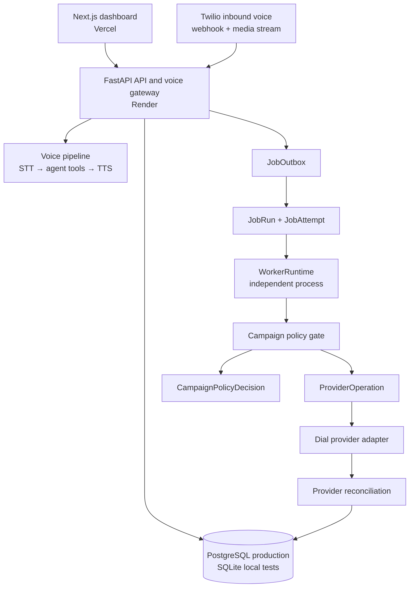
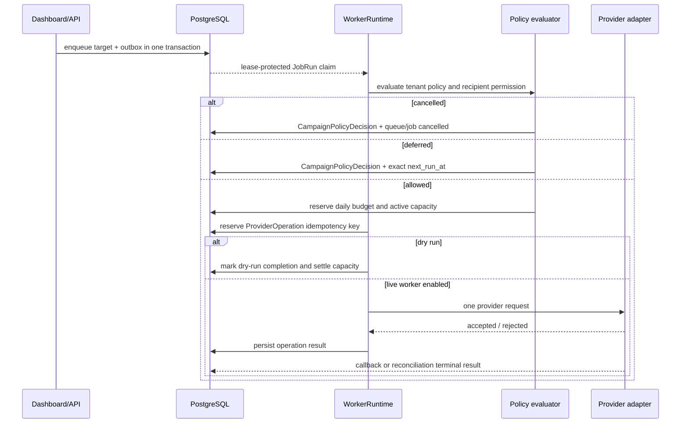

# VoxFlow Architecture

**Last updated:** 2026-08-20
**Current milestone:** Day 30 — tenant policy controls and auditable cancellation complete.
**Operating mode:** Inbound voice and dashboard functions are deployed. Campaign dispatch is implemented but globally safe-staged in production.

## 1. System boundaries

VoxFlow separates the latency-sensitive inbound voice path from durable operational work. FastAPI receives web/API requests and persists intent. Durable workers claim lease-protected jobs from the database and execute bounded units of background work. Campaign provider calls are not performed inside the campaign HTTP request transaction.



| Boundary | Owner | Rule |
|---|---|---|
| Inbound voice | FastAPI voice pipeline | Preserve per-call latency; never wait on campaign jobs or outbox relays. |
| Command/control plane | FastAPI routes | Validate and persist tenant-scoped intent; do not create an outbound provider side effect inline. |
| Durable execution | `WorkerRuntime` | Claim only leased jobs, use conditional transitions, retry only typed transient errors. |
| Provider side effect | `ProviderOperation` | One idempotency key owns one provider request; retries reconcile rather than re-dial. |
| Campaign permission | `campaign_policy.py` | Fail closed before provider intent: policy, consent, opt-out, timing, budget, and capacity. |
| Operator visibility | Job health and campaign dashboard | Show tenant-owned counts and redacted audit/read models only. |

## 2. Runtime components

### Frontend

`apps/web` is a Next.js 16.3.1 application deployed on Vercel. It uses TypeScript, Tailwind CSS, and SWR. The tenant context is passed to campaign lists, queue views, run/stage actions, health, and recent job reads. The campaigns page visualizes staged rollout state, durable job health, queued targets, and policy cancellations.

### FastAPI backend

`apps/api/voxflow_api` provides synchronous and asynchronous SQLAlchemy paths, inbound voice routes, dashboard APIs, campaign APIs, and job-health read models. The backend runs on Render in the deployed environment and supports SQLite for deterministic local tests.

### Durable job subsystem

The Day 25–30 subsystem lives in `apps/api/voxflow_api/jobs/`.

| Component | Responsibility |
|---|---|
| `enqueue.py` | Atomically persists campaign target intent and outbox event. |
| `outbox.py` | Leases and relays unprocessed transactional outbox events. |
| `repository.py` | Atomic claim, lease extension, success, retry, cancel, dead-letter, and recovery transitions. |
| `worker.py` | Bounded polling runtime, typed outcomes, backoff, graceful drain, and stale-worker protection. |
| `campaign_worker_service.py` | Standalone campaign worker entry point with global gate and canary tenant filter. |
| `campaign_dispatch.py` | Campaign target handler: policy, capacity, dry run, provider-operation reservation, and no-redial behavior. |
| `provider_operations.py` | Durable idempotency reservation and provider operation updates. |
| `reconciliation.py` | Applies provider terminal outcomes back to job/campaign state. |
| `campaign_policy.py` | Tenant policy evaluation, consent/opt-out enforcement, reservations, and immutable audit records. |

## 3. Campaign dispatch lifecycle



A `requested` provider operation with unknown acceptance is retried through reconciliation, not by making a second provider request. An `accepted` operation waits for a callback/reconciliation terminal result. Terminal outcomes settle active capacity; a pre-request policy deferral or lease loss releases unused capacity and budget reservation.

## 4. Tenant policy and auditable cancellation

The policy gate runs before `ProviderOperation` reservation. A dispatch target must satisfy all conditions below.

| Check | Data source | Failed outcome |
|---|---|---|
| Tenant policy exists and is enabled | `tenant_campaign_policies` | `tenant_policy_missing` or `tenant_policy_disabled` cancellation |
| Campaign is active/running | `outbound_campaigns` | `campaign_not_active` cancellation |
| Consent is granted | `recipient_campaign_preferences` | `consent_not_granted` cancellation |
| Recipient is not opted out | `recipient_campaign_preferences` | `recipient_opted_out` cancellation |
| Consent purpose covers dispatch | Recipient preference + campaign type | `consent_purpose_mismatch` cancellation |
| Calling window is open in tenant timezone | Tenant policy | `outside_calling_window` exact deferral |
| Daily budget remains | `tenant_daily_dispatch_usage` | `daily_call_budget_exhausted` deferral |
| Active tenant capacity remains | Same usage record | `tenant_concurrency_limited` deferral |

Every policy evaluation appends a `campaign_policy_decisions` record. The operator endpoint returns decision, reason code, timestamp, and next eligible time, but does not expose raw evidence JSON. Policy cancellations map to terminal durable `cancelled` jobs rather than dead letters.

## 5. Data model

The core business schema remains tenant scoped. Durable dispatch adds the following tables.

| Table | Purpose |
|---|---|
| `job_runs` | Durable queued work, state, lease, retry timing, idempotency key, and terminal outcome. |
| `job_outbox` | Transactional events persisted with domain changes and published by a relay. |
| `job_attempts` | Immutable execution-attempt evidence. |
| `provider_operations` | Provider-side idempotency and reconciliation boundary. |
| `tenant_campaign_policies` | Tenant timezone, calling window, quota, capacity, and enablement. |
| `recipient_campaign_preferences` | Consent, purpose, opt-out, and provenance per tenant/phone. |
| `tenant_daily_dispatch_usage` | Tenant-local daily reservation and active-dispatch counters. |
| `campaign_dispatch_reservations` | One capacity reservation per job with active/released/settled lifecycle. |
| `campaign_policy_decisions` | Immutable Day 30 policy audit evidence. |

Production migrations are ordered as `003_durable_job_ledger.sql`, `004_outbox_relay_state.sql`, then `005_campaign_policy_controls.sql`.

## 6. Production safety and rollout

The deployed backend remains in a non-executing campaign posture:

```text
DURABLE_CAMPAIGN_WORKER_ENABLED=false
activation_mode=staged
canary_allowed=false
dry_run=true
```

These settings are a deliberate layered control, not a missing feature. An internal canary must use a dedicated worker process, explicit tenant allow-list, dry-run evidence, tenant policy configuration, consented test target, concurrency one, monitoring, and a rollback owner. The dashboard’s `Launch Campaign` control does not bypass the worker gate or invoke the provider inline.

## 7. Engineering quality gates

| Surface | Command |
|---|---|
| Backend lint | `cd apps/api && .venv/bin/ruff check voxflow_api tests` |
| Backend tests | `cd apps/api && .venv/bin/pytest -q` |
| Frontend lint | `npm run lint --workspace=apps/web` |
| Frontend production build | `npm run build --workspace=apps/web` |
| Live job posture | `GET /api/jobs/health?tenant_id=varun` |

At the Day 30 delivery point, the backend suite has 182 passing tests and GitHub CI validates API lint, API test, and web lint/build on every `main` delivery.

## References

- `apps/api/voxflow_api/jobs/`
- `apps/api/voxflow_api/db.py`
- `migrations/003_durable_job_ledger.sql`
- `migrations/004_outbox_relay_state.sql`
- `migrations/005_campaign_policy_controls.sql`
- `apps/web/src/app/dashboard/campaigns/page.tsx`
