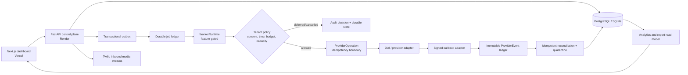

# VoxFlow

VoxFlow is a **Hindi-English voice operations platform** for supply-chain teams. It combines a FastAPI voice and operations backend with a Next.js dashboard for inbound support workflows, operational data, campaigns, escalations, and durable dispatch visibility.

> **Current production posture:** the campaign-worker global kill switch is off. Outbound campaign dispatch is deliberately **safe-staged**. No API request, browser verification, or dashboard action should place a real provider call unless an explicitly approved future canary enables the worker and tenant policy controls.

| Area | Current implementation |
|---|---|
| Frontend | Next.js **16.3.1**, TypeScript, Tailwind CSS, SWR, deployed on Vercel. |
| Backend | FastAPI, Python 3.12, SQLAlchemy 2.0, SQLite for local tests and PostgreSQL-compatible production migrations. |
| Voice | Twilio inbound webhook/media-stream path, Dial provider adapter for outbound capability, Hindi-English agent tooling. |
| Durable execution | PostgreSQL-backed job ledger, transactional outbox, atomic claims, leases, retry/backoff, graceful drain, provider-operation idempotency. |
| Campaign safety | Feature gate, canary scoping, dry-run mode, tenant policy checks, consent/opt-out controls, capacity reservations, audit decisions, cancellation. |
| Analytics and reporting | Tenant-safe KPI/trend aggregates, durable monitoring signals, provider-lifecycle totals, operator attention queue, and redacted CSV enterprise reports. |
| Provider callbacks | Fail-closed signed callback ingress, immutable event ledger, tenant-derived operation lookup, unknown-call quarantine, and idempotent terminal reconciliation. |
| Production | [Vercel dashboard](https://voxflow-voice-agent.vercel.app) and [Render API](https://voxflow-voice-agent.onrender.com/api/health). |

## What is complete through Day 32

VoxFlow has completed the durable-campaign foundation and policy-control program. Campaign targets are queued as durable jobs rather than called from the HTTP request path. The worker implementation protects provider side effects with a tenant-scoped idempotency key and reconciles provider terminal results without a blind re-dial.

Day 30 adds an explicit permission boundary before a provider operation may be reserved. The handler requires an enabled tenant policy, an active campaign, recorded recipient consent, no opt-out, an allowed consent purpose, an open tenant-local calling window, daily budget, and available tenant capacity. A denied target is terminally **cancelled** with immutable audit evidence. A temporarily ineligible target is **deferred** to the exact next eligible time.

Day 31 turns persisted calls, campaign targets, policy decisions, jobs, leases, and outbox state into a tenant-safe analytics read model. The dashboard presents real KPIs, daily trends, durable-work attention signals, staged rollout status, and a CSV report that excludes transcripts, phone numbers, raw job payloads, and policy evidence.

Day 32 adds the provider-to-VoxFlow lifecycle return path. `POST /api/provider-callbacks/events` is fail-closed when its signature secret is absent, derives tenant ownership only from a stored provider operation, records each verified event immutably, quarantines unknown provider IDs, and prevents duplicate or late events from reopening terminal work or causing a re-dial. Provider lifecycle totals are visible as aggregates only in the analytics dashboard and enterprise CSV.

| Day | Delivered capability | Primary evidence |
|---:|---|---|
| 25 | Durable job ledger, outbox, attempts, and provider operations | Migration `003_durable_job_ledger.sql` |
| 26 | Atomic claims, leases, stale-worker protection, and recovery | Lease and competing-worker tests |
| 27 | Generic worker runtime, full-jitter retries, and graceful drain | Worker runtime tests |
| 28 | Transactional outbox relay, job-health APIs, operator panel, safe staging | Migration `004_outbox_relay_state.sql` |
| 29 | Controlled canary worker, dry run, no-redial provider reconciliation | Campaign-dispatch integration tests |
| 30 | Tenant policy, consent, opt-out, budget/capacity controls, auditable cancellation | Migration `005_campaign_policy_controls.sql` |
| 31 | Advanced analytics, pull-based monitoring, operator attention queue, redacted enterprise CSV reporting | `tests/test_analytics.py` and `/api/analytics` |
| 32 | Signed callback ingress, immutable provider events, quarantine, idempotent terminal reconciliation, lifecycle analytics | `tests/test_provider_callbacks.py` and migration `006_provider_callback_lifecycle.sql` |

## Production safety controls

The following controls are intentional and must remain in place until a formal pilot canary is approved.

| Control | Meaning |
|---|---|
| `DURABLE_CAMPAIGN_WORKER_ENABLED=false` | Global hard stop for campaign worker execution in production. |
| `activation_mode: staged` | Job-health endpoint communicates that dispatch is not active. |
| `canary_allowed: false` | The deployed tenant is not admitted to a canary worker cohort. |
| `dry_run: true` | The deployed read model reports a non-provider test posture. |
| Unconfigured tenant policy | A future worker attempt fails closed rather than assuming call permission. |

An approved live canary needs all of the following: one explicitly allowed tenant, a tenant policy with a valid IANA timezone and local calling window, a recorded consented E.164 test recipient, no opt-out, capacity and daily limit of one, dry-run evidence, an operator owner, and a rollback plan.

## Architecture



The HTTP API persists intent quickly. A durable worker—not an HTTP handler—owns campaign execution. The policy evaluator runs before provider intent reservation, and provider callbacks/reconciliation update the same durable operation rather than creating a second call.

## Repository layout

```text
apps/
  api/                         FastAPI service, durable jobs, migrations tests
  web/                         Next.js dashboard
migrations/                    Production PostgreSQL migration scripts
.learning/                     Local-only daily implementation and theory journal
.planning/                     Planning archive and current roadmap index
docs/                          Product architecture and demo material
```

## Local development

### Prerequisites

- Node.js 22 or newer
- Python 3.12
- npm or pnpm

### Start the API

```bash
cd apps/api
python3.12 -m venv .venv
source .venv/bin/activate
pip install -r requirements.txt
python -m voxflow_api.seed --reset
uvicorn voxflow_api.main:app --reload --port 8000
```

### Start the dashboard

```bash
cd apps/web
npm install
cp .env.example .env.local
npm run dev
```

The dashboard runs at `http://localhost:3000`; the API runs at `http://localhost:8000`.

### Local database and migrations

SQLite test and development databases are created from SQLAlchemy metadata. Production PostgreSQL must apply the checked-in migration sequence in order:

```text
migrations/003_durable_job_ledger.sql
migrations/004_outbox_relay_state.sql
migrations/005_campaign_policy_controls.sql
migrations/006_provider_callback_lifecycle.sql
```

Do not enable the campaign worker as a migration smoke test. The policy and worker test suites use mocked providers and must remain the default verification path.

## Quality checks

Run all backend checks from `apps/api`:

```bash
.venv/bin/ruff check voxflow_api tests
.venv/bin/pytest -q
```

Run frontend checks from the repository root:

```bash
npm run lint --workspace=apps/web
npm run build --workspace=apps/web
```

At the Day 32 local delivery point, the backend suite has **188 passing tests** and the frontend production build generates **20 routes**. The GitHub CI workflow runs API lint, API tests, and web lint/build on `main`.

## Deployment

| Component | Service | URL |
|---|---|---|
| Web dashboard | Vercel | <https://voxflow-voice-agent.vercel.app> |
| API | Render | <https://voxflow-voice-agent.onrender.com> |
| Job health | Render | <https://voxflow-voice-agent.onrender.com/api/jobs/health?tenant_id=varun> |
| Analytics overview | Render | <https://voxflow-voice-agent.onrender.com/api/analytics/overview?tenant_id=varun&days=30> |
| Provider callbacks | Render | `<POST /api/provider-callbacks/events>`; intentionally returns `503` until a provider-specific callback secret and sandbox adapter are approved. |

The frontend uses `NEXT_PUBLIC_API_URL=https://voxflow-voice-agent.onrender.com`. Analytics and callback evidence are read-only with respect to campaign activation: a callback can reconcile only a pre-existing provider operation and cannot create a dial. The backend must retain the staged campaign configuration until a formal internal canary is approved after Day 33 sandbox certification.

## Documentation map

| Document | Use it for |
|---|---|
| [ARCHITECTURE.md](ARCHITECTURE.md) | Current system and durable-dispatch design. |
| [PRD.md](PRD.md) | Product scope, user outcomes, and pilot boundary. |
| [PHASES.md](PHASES.md) | Day-by-day delivery record and next implementation phase. |
| [MEMORY.md](MEMORY.md) | Live project status and next operational action. |
| [schema.md](schema.md) | Schema reference, durable-job tables, and policy records. |
| [SETUP.md](SETUP.md) | Current Render/Vercel deployment and staging verification procedure. |
| [security_audit.md](security_audit.md) | Security controls, known gaps, and verification commands. |
| [.learning/README.md](.learning/README.md) | Local-only theory and implementation journal. |
| [.planning/planning_overview.md](.planning/planning_overview.md) | Current roadmap index and historical-plan boundary. |

## License

Distributed under the MIT License. See [LICENSE](LICENSE).
