# 🎙️ VoxFlow

### Voice Operations for Modern Supply Chains

  A Hindi-English operations workspace that helps teams turn supply-chain conversations into clear, measurable action.

  
  
  

  
  
  
  

[**Explore the product**](https://voxflow-voice-agent.vercel.app) &nbsp;·&nbsp; [**Day-by-Day Implementation Tracker**](DAY_TRACKER.md) &nbsp;·&nbsp; [**Capabilities**](#capabilities) &nbsp;·&nbsp; [**Architecture**](ARCHITECTURE.md) &nbsp;·&nbsp; [**Get started**](#getting-started)

---

## 📚 Table of Contents

- [Overview](#overview)
- [Day-by-Day Implementation Tracker (Days 1–38+)](DAY_TRACKER.md)
- [Why VoxFlow](#why-voxflow)
- [Capabilities](#capabilities)
- [How VoxFlow Works](#how-voxflow-works)
- [Use Cases](#use-cases)
- [Integration](#integration)
  - [A Practical Rollout](#a-practical-rollout)
- [Getting Started](#getting-started)
- [Built for Stakeholders](#built-for-stakeholders)
- [Responsible Operations](#responsible-operations)
- [Product Access](#product-access)
- [License](#license)

---

## 🌐 Overview

Supply-chain operations rely on thousands of time-sensitive conversations: confirming purchase orders, responding to shipment changes, preparing appointments, resolving stock exceptions, and escalating issues before they become delays.

**VoxFlow** gives operations teams one place to understand those conversations, coordinate the next step, and keep important work visible from first contact to resolution.

> **One workspace for the conversations that keep supply chains moving.**

| When a team needs to… | VoxFlow helps them… |
|---|---|
| Keep operational conversations visible | Bring calls, follow-ups, escalations, and business context into one shared view. |
| Serve a multilingual ecosystem | Support natural Hindi-English voice experiences for frontline operations. |
| Coordinate across partners | Connect supplier, distributor, warehouse, and customer communication to real operational events. |
| Improve accountability | Clarify ownership, outstanding work, outcomes, and next steps. |
| Scale with confidence | Introduce communication workflows gradually with practical human oversight. |

---

## ✨ Why VoxFlow

Traditional operational coordination is spread across calls, inboxes, spreadsheets, and disconnected business systems. VoxFlow acts as a focused operational layer that brings **conversation**, **context**, and **follow-through** together.

| Challenge | VoxFlow approach |
|---|---|
| Important calls lose their context | Connect conversations to the operational work that triggered them. |
| Teams cannot see what is still open | Make follow-ups, escalations, and handoffs easier to understand. |
| Partners communicate in different languages | Deliver a Hindi-English voice experience designed for supply-chain environments. |
| Leaders lack a live operational picture | Surface activity, workload, exceptions, and service trends in a shared workspace. |

---

## ⚡ Capabilities

| Capability | What it means for your organisation |
|---|---|
| **🎙️ Voice operations** | Organise supply-chain conversations through a Hindi-English voice experience. |
| **📞 Inbound support workspace** | Capture incoming requests and connect them with the context and follow-up activity that matter. |
| **🤝 Partner coordination** | Support purchase-order confirmation, delivery updates, appointment reminders, and exception management. |
| **📊 Operations command centre** | Track calls, orders, shipments, stock, appointments, and escalations from one workspace. |
| **🔁 Workflow orchestration** | Prepare targeted communication workflows around business events, priorities, and operational rules. |
| **📈 Analytics & reporting** | Understand activity, follow-up workload, escalation patterns, and service performance. |
| **🔌 Enterprise connectivity** | Work alongside ERP, WMS, TMS, CRM, telephony, and reporting platforms. |

---

## 🧭 How VoxFlow Works

```mermaid
flowchart LR
    A[📦 Operational event] --> B[🔗 Context from your systems]
    B --> C[🎙️ VoxFlow workspace]
    C --> D[💬 Voice interaction & team workflow]
    D --> E[✅ Clear operational outcome]
    E --> F[📊 Follow-up, escalation & reporting]

    style A fill:#E0F2FE,stroke:#0284C7,color:#0C4A6E
    style B fill:#EEF2FF,stroke:#4F46E5,color:#312E81
    style C fill:#ECFDF5,stroke:#059669,color:#064E3B
    style D fill:#FFF7ED,stroke:#EA580C,color:#7C2D12
    style E fill:#FDF2F8,stroke:#DB2777,color:#831843
    style F fill:#F5F3FF,stroke:#7C3AED,color:#4C1D95
```

VoxFlow connects the operational event to the people and conversations responsible for moving work forward. Teams can understand the context, coordinate a response, and retain visibility over the resulting outcome.

---

## 🏗️ Use Cases

| Function | High-value VoxFlow workflows |
|---|---|
| **Procurement** | Purchase-order acknowledgement, supplier follow-up, query handling, and exception resolution. |
| **Logistics** | Delivery updates, shipment exceptions, transporter coordination, and appointment preparation. |
| **Warehouse operations** | Dock coordination, stock-related follow-up, handoffs, and scheduling support. |
| **Customer operations** | Inbound support, issue routing, escalation visibility, and service follow-through. |
| **Business leadership** | Operational activity, workload, trend, and service-performance visibility. |

---

## 🔌 Integration

VoxFlow is designed to complement—not replace—the systems your teams already rely on. It can be aligned with approved information from ERP, WMS, TMS, CRM, telephony, and reporting platforms.

| Integration area | Example business context |
|---|---|
| **ERP & procurement systems** | Purchase orders, supplier records, approval status, and material requirements. |
| **Warehouse & inventory systems** | Stock availability, warehouse tasks, dock schedules, and movement status. |
| **Transport & logistics systems** | Shipment milestones, carrier details, delivery exceptions, and route events. |
| **Customer & partner platforms** | Account details, service history, contacts, and case context. |
| **Telephony & communications** | Approved voice channels and communication workflows for operational teams. |

### 🚀 A Practical Rollout

1. **Choose the operational moment.** Start with a focused workflow such as purchase-order confirmation, shipment exception follow-up, or appointment coordination.
2. **Connect the required context.** Identify the approved operational data and systems that should inform the conversation.
3. **Shape the team experience.** Define views, responsibilities, escalation paths, and reporting that fit the operating model.
4. **Learn and expand.** Start with a measured use case, review outcomes with the team, and grow when it delivers value.

---

## 🛠️ Getting Started

A successful VoxFlow implementation begins with a single workflow that is meaningful, measurable, and owned by the right operating team.

| Step | What to prepare |
|---|---|
| **1. Define the workflow** | The operational event, expected outcome, business owner, and success measure. |
| **2. Identify source systems** | The approved order, shipment, inventory, supplier, or customer context required by the workflow. |
| **3. Align the operating model** | User groups, escalation responsibilities, language needs, and reporting expectations. |
| **4. Start with a focused rollout** | A limited, reviewable use case that the team can learn from before broadening adoption. |

---

## 👥 Built for Stakeholders

| Stakeholder | What they gain |
|---|---|
| **Operations leaders** | A clearer view of workload, exceptions, follow-up, and service performance. |
| **Frontline teams** | Context-rich workspaces that reduce switching between calls, spreadsheets, inboxes, and systems. |
| **IT & transformation teams** | A flexible operational layer that can align with existing enterprise systems and governance practices. |
| **Partners & suppliers** | More consistent, timely, and understandable operational communication. |

---

## 🛡️ Responsible Operations

VoxFlow is designed for business environments where trust, accountability, and data stewardship matter. Organisations remain in control of their communication policies, user access, retention requirements, and regulatory responsibilities. The platform is intended to support measured adoption, reviewable outcomes, and human oversight at operationally significant moments.

---

## 🌍 Product Access

Explore the current VoxFlow product experience at [**voxflow-voice-agent.vercel.app**](https://voxflow-voice-agent.vercel.app).

For an implementation discussion, bring a target workflow, the relevant source systems, intended users, language needs, and the operational outcome your team wants to improve.

---

## 📄 License

Distributed under the [MIT License](LICENSE).
