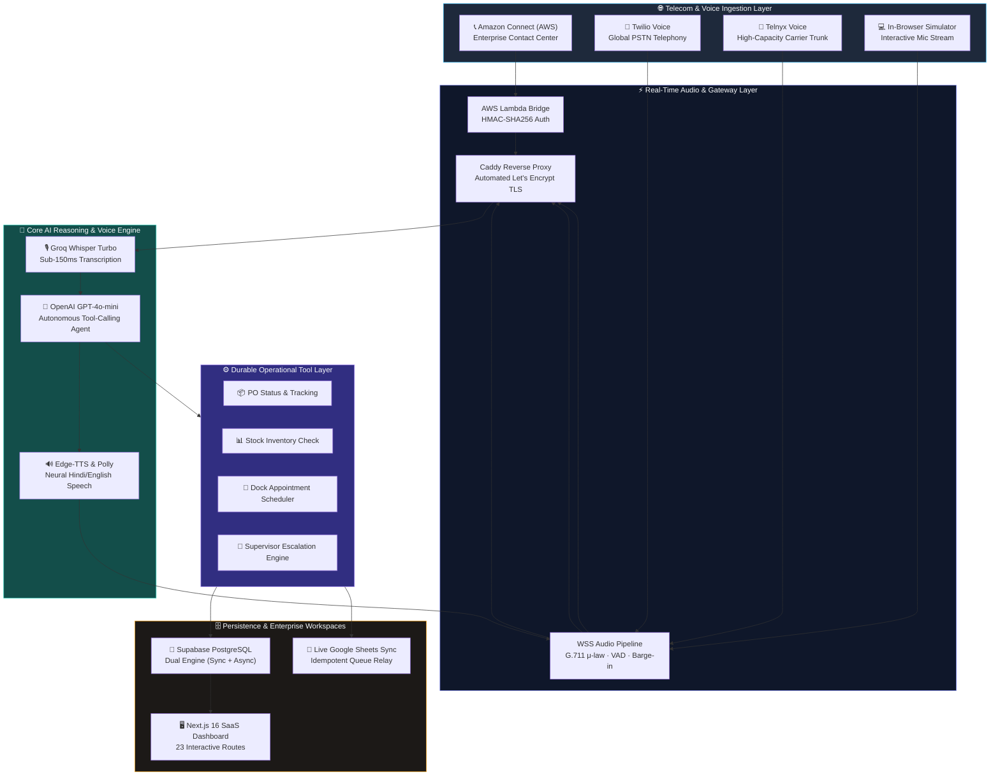

<div align="center">

# 🎙️ VoxFlow

### **Enterprise Conversational AI Voice Agent for Modern Supply Chains**
*Automate inbound & outbound supplier operations, purchase-order confirmations, dock scheduling, and live CRM/ERP synchronization with sub-second multilingual voice intelligence.*

<br/>

<p align="center">
  <a href="https://voxflow-voice-agent.vercel.app"></a>
</p>

<p align="center">
  
  
  
  
</p>

<p align="center">
  
  
  
  <a href="LICENSE"></a>
</p>

<br/>

[**Explore Live SaaS App**](https://voxflow-voice-agent.vercel.app) &nbsp;·&nbsp; [**Implementation Tracker**](DAY_TRACKER.md) &nbsp;·&nbsp; [**System Architecture**](ARCHITECTURE.md) &nbsp;·&nbsp; [**Cloud Setup Guide**](deploy/ORACLE_DEPLOY.md)

</div>

---

## 💼 Executive Summary & ROI for Stakeholders

Supply chain and logistics enterprises handle tens of thousands of repetitive, time-critical phone calls every month—coordinating transporters, verifying purchase-order delivery ETAs, checking warehouse stock levels, and booking loading dock slots.

**VoxFlow** is a B2B AI Voice Operations platform designed to eliminate operational friction and manual call queues:

```
                  ┌─────────────────────────────────────────────────────────┐
                  │                 THE BUSINESS IMPACT                     │
                  ├────────────────────────────┬────────────────────────────┤
                  │   70%+ Inbound Deflection  │   Sub-600ms Voice Latency  │
                  │   Zero Missed PO Check-ins │   Live Google Sheets / ERP │
                  │   24/7 Bilingual Coverage  │   Multi-Tenant Enterprise  │
                  └────────────────────────────┴────────────────────────────┘
```

| Problem in Operations Today | VoxFlow Solution |
|---|---|
| **High Call Center Overhead**: Operations teams spend 40% of their day answering status check calls. | **Autonomous Voice Agent**: Resolves PO inquiries, stock checks, and dock scheduling with zero human intervention. |
| **Language Barriers in Emerging Markets**: Field drivers and warehouse operators speak native regional languages. | **Natural Hindi-English (Hinglish) Support**: Code-switching speech recognition and neural TTS for seamless communication. |
| **Data Silos & Delayed Data Entry**: Call outcomes are lost in spreadsheets or updated hours after the call ends. | **Real-Time Data Write-Back**: Idempotent synchronization directly into Google Sheets, PostgreSQL, and ERP databases. |
| **Single-Carrier Lock-In**: Outages or price spikes on single telecom vendors cripple business communications. | **Multi-Carrier Cloud Abstraction**: Seamless carrier routing across **Amazon Connect**, **Twilio**, and **Telnyx**. |

---

## 🏗️ End-to-End System Architecture



---

## ⚡ Core Platform Capabilities

### 1. 🎙️ Natural Multilingual Voice Intelligence
- **Hindi & English (Hinglish)** conversational fluency tuned specifically for supply chain vocabulary (e.g. *“PO number kya hai?”*, *“Delivery schedule kar do”*).
- **Instant Speech Barge-In**: When a human speaks while the agent is speaking, the outbound playback queue is flushed immediately within 50ms.
- **Voice Activity Detection (VAD)**: RMS energy filtering with 450ms trailing silence threshold eliminates awkward conversational lag.

### 2. 📦 Autonomous Supply Chain Workflows
- **Purchase Order Inquiries**: Look up order numbers, item quantities, delivery statuses, and supplier milestones.
- **Real-Time Stock Checks**: Query SKU quantities across multiple warehouse storage bins and availability status.
- **Dock Appointment Booking**: Schedule loading and unloading appointments with automated conflict validation.
- **Smart Escalations**: Detects caller frustration or complex disputes and transfers call to a human supervisor with complete conversation summaries.

### 3. 📑 Live Enterprise Data Synchronization
- **Live Google Sheets Mirror**: Appends every call turn, order update, and appointment directly into Google Sheets with background idempotency retry queues.
- **Transactional Outbox Pattern**: Guarantees zero lost turns even during network dropouts or backend restarts.

### 4. 🏢 Multi-Tenant SaaS Workspace
- **Organization & Role-Based Isolation**: Distinct workspaces for individual companies (e.g., Varun Beverages, Amul) with dedicated phone numbers and isolated data partitions.
- **Full Operational Dashboard**: 23 compiled Next.js routes covering Calls, Escalations, Appointments, Inventory, Shipments, Campaigns, and Web-based Call Simulators.

---

## 📞 Multi-Carrier Telephony Matrix

VoxFlow operates concurrently across multiple global cloud carriers:

| Provider | Inbound Phone Routing | Capabilities | Integration Mechanism |
|---|---|---|---|
| **Amazon Connect (AWS)** | Dedicated Enterprise DID *(Assigned per tenant)* | 90 Free Min/Mo, Global Contact Center | AWS Lambda Bridge + Polly Neural Voice |
| **Twilio Voice** | Global Number Pool *(Configurable per country)* | Worldwide PSTN Inbound & Outbound | TwiML Webhook + Real-Time WSS Stream |
| **Telnyx** | Low-Cost Carrier Trunk *(US/UK/EU)* | High-Throughput TeXML Call Control | TeXML Webhook + G.711 μ-law Streaming |
| **In-Browser Simulator** | Interactive Web Microphone | 100% Free, Zero Telecom Setup | WebAudio WebSocket at `/dashboard/simulator` |

---

## 🚀 Quickstart & Local Development

### Prerequisites
- Python 3.12+
- Node.js 20+ (Node 22 recommended)
- PostgreSQL (or local SQLite)

### 1. Clone the Repository
```bash
git clone https://github.com/jeevesh2515/voxflow-voice-agent.git
cd voxflow-voice-agent
```

### 2. Configure Environment Variables
```bash
cp .env.example .env
# Edit .env with your OpenAI, Groq, and database credentials
```

### 3. Start the Backend API
```bash
cd apps/api
python3 -m venv .venv
source .venv/bin/activate
pip install -r requirements.txt

# Run backend server
uvicorn voxflow_api.main:app --host 0.0.0.0 --port 8000 --reload
```

### 4. Start the Frontend Dashboard
```bash
# In another terminal window from the repo root
npm install
npm run dev
# Dashboard opens at http://localhost:3000
```

---

## 🧪 Comprehensive Verification Suite

Run all automated test suites locally:

```bash
# 1. Run full backend test suite (279 unit, integration & resilience tests)
cd apps/api
pytest tests/ -v

# 2. Run backend linter
ruff check .

# 3. Run frontend typecheck and static build
cd ../web
npm run build
```

---

## 📊 Deployment & Infrastructure

- **Cloud Backend**: Docker Compose running on an **Oracle Cloud Always-Free ARM VM** (4 OCPU, 24GB RAM) with **Caddy** automated TLS reverse proxy.
- **Cloud Frontend**: **Vercel** Edge Network with sub-100ms global static asset delivery.
- **Serverless Voice Bridge**: **AWS Lambda** (`us-west-2`) integrated with **Amazon Connect Contact Flows**.
- **Live VM Sync Command**: `./deploy/sync-vm.sh` (automated code push, database migration, container reload, and zero-downtime health verification).

---

## 🏢 Enterprise Inquiries, Custom Pilots & Product Demos

VoxFlow is available as an enterprise B2B SaaS platform with private cloud deployment options (AWS, Oracle Cloud, Azure) or fully managed multi-tenant instances.

If you are a business stakeholder, supply chain leader, or enterprise partner interested in:
- **Scheduling a Live Interactive Voice Agent Demonstration**
- **Launching a Customized Pilot with Dedicated Phone Lines (US / UK / India)**
- **Connecting VoxFlow to your ERP (SAP, Oracle, NetSuite), WMS, or Custom Database**
- **Commercial Licensing, SLA Support, and Tenant Onboarding**

👉 **Get in touch with the founder**: [Open a GitHub Inquiry](https://github.com/jeevesh2515/voxflow-voice-agent/issues) or reach out directly to discuss your supply chain workflow requirements.

---

## 📄 License

Distributed under the [MIT License](LICENSE). Built for enterprise scalability and modern supply chains.
