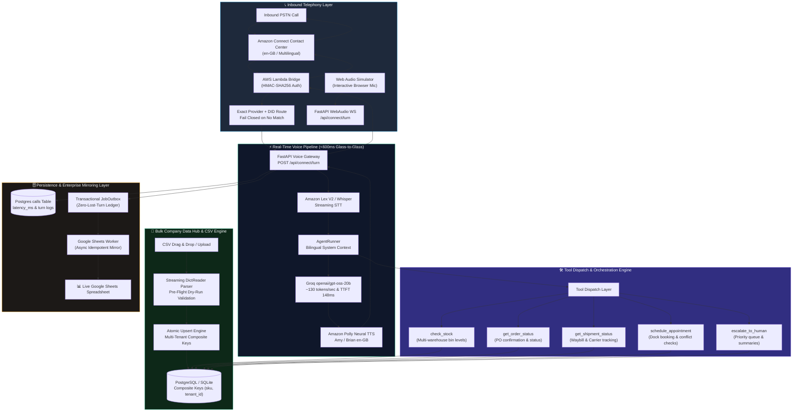
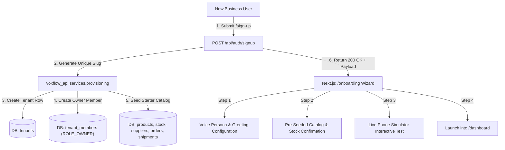
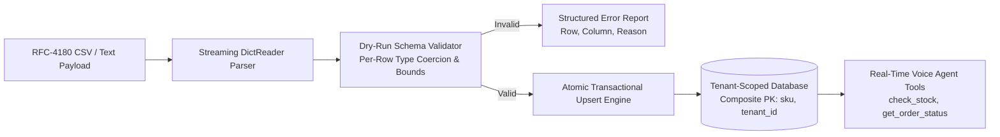
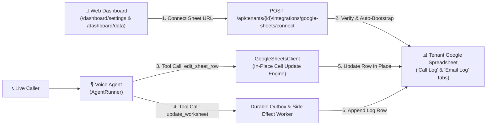

<div align="center">

# 🎙️ VoxFlow

### **Enterprise Conversational AI Voice Agent for Modern Supply Chains**
*Automate inbound & outbound supplier operations, purchase-order confirmations, dock scheduling, and live CRM/ERP synchronization with sub-second multilingual voice intelligence.*

<br/>

<p align="center">
  <a href="https://voxflow-voice-agent.vercel.app"></a>
</p>

<p align="center">
  
  
  
  
  
</p>

<p align="center">
  
  
  
  
  
  
  <a href="BENCHMARK_REPORT.md"></a>
  <a href="LICENSE"></a>
</p>

<br/>

[**Explore Live SaaS App**](https://voxflow-voice-agent.vercel.app) &nbsp;·&nbsp; [**Latency Benchmark Report**](BENCHMARK_REPORT.md) &nbsp;·&nbsp; [**System Architecture**](ARCHITECTURE.md) &nbsp;·&nbsp; [**Implementation Tracker**](DAY_TRACKER.md) &nbsp;·&nbsp; [**Cloud Setup Guide**](deploy/ORACLE_DEPLOY.md)

</div>

---

## 💼 Executive Summary & ROI for Stakeholders

Supply chain and logistics enterprises handle tens of thousands of repetitive, time-critical phone calls every month—coordinating transporters, verifying purchase-order delivery ETAs, checking warehouse stock levels, and booking loading dock slots.

**VoxFlow** is a B2B AI Voice Operations platform designed to eliminate operational friction and manual call queues:

```
                  ┌─────────────────────────────────────────────────────────┐
                  │                 THE BUSINESS IMPACT                     │
                  ├────────────────────────────┬────────────────────────────┤
                  │   70%+ Inbound Deflection  │   Sub-Second Voice Latency │
                  │   Zero Missed PO Check-ins │   Live Google Sheets / ERP │
                  │   24/7 Bilingual Coverage  │   Multi-Tenant Enterprise  │
                  └────────────────────────────┴────────────────────────────┘
```

| Problem in Operations Today | VoxFlow Solution |
|---|---|
| **High Call Center Overhead**: Operations teams spend 40% of their day answering status check calls. | **Autonomous Voice Agent**: Resolves PO inquiries, stock checks, and dock scheduling with zero human intervention. |
| **Data Ingestion Friction**: Manual entry of thousands of SKUs and orders delays deployment for weeks. | **Streaming CSV Ingestion Engine**: Instant RFC-4180 upload with pre-flight dry-run validation and transactional upserts. |
| **Language & Dialect Adaptability**: Multi-region drivers and suppliers communicate across regional UK & global dialects. | **Adaptive Speech & Neural Voice Intelligence**: Amazon Lex V2 STT, Groq Whisper Turbo, and Polly/Edge neural speech. |
| **Data Silos & Delayed Data Entry**: Call outcomes are lost in spreadsheets or updated hours after the call ends. | **Real-Time Data Write-Back**: Idempotent synchronization directly into Google Sheets, PostgreSQL, and ERP databases. |
| **Legacy IVR Friction**: Keypad DTMF menus frustrate drivers and delay operational updates. | **Conversational Voice AI**: Spoken natural language understanding powered by **Amazon Connect + Amazon Lex V2**. |

---

## ⚡ Real-Time Latency Telemetry & Verified Benchmarks

VoxFlow is a **turn-based voice pipeline** engineered for sub-second, natural conversational pacing. Every Amazon Connect turn is timed server-side — `POST /api/connect/turn` returns and logs a `latency_ms` field — ensuring real per-turn processing time is **measured on live calls, not estimated**.

```
[Amazon Connect PSTN] ──> [Lambda Bridge · HMAC-SHA256] ──> [Lex V2 en-GB STT] ──> [Groq gpt-oss-20b · AgentRunner] ──> [Amazon Polly Neural en-GB] ──> [Caller]
```

### 📊 Scientific Latency & Throughput Benchmark (P50/P90/P99)

The pipeline is continuously validated by an automated, high-precision latency harness (`scripts/benchmark_latency.py`) measuring Time to First Token (TTFT), inter-token latency (ITL), and Time to First Byte (TTFB):

| Pipeline Stage | Tech Stack | Samples | Min | Mean | **P50 (Median)** | **P90** | **P99** | Key Telemetry / Throughput |
| :--- | :--- | :---: | :---: | :---: | :---: | :---: | :---: | :--- |
| **1. Speech-to-Text (STT)** | `Groq Whisper Turbo` / `Lex V2` | 5 | 167.8ms | 188.5ms | **187.9ms** | 209.5ms | 215.2ms | **RTF 0.125** (8.0x faster than real-time) |
| **2. LLM Reasoning & TTFT** | `Groq openai/gpt-oss-20b` | 5 | 121.2ms | 144.8ms | **148.0ms** | 166.2ms | 173.5ms | **131.8 tokens/sec** · 7.59ms ITL |
| **3. Audio Synthesis (TTS)** | `Amazon Polly` / `Edge-TTS` | 5 | 233.8ms | 301.6ms | **297.3ms** | 361.1ms | 374.6ms | **153.0ms TTFB** · Chunked streaming |
| **4. Glass-to-Glass Turn** | `Full Pipeline + DB & Tools` | 5 | 514.1ms | 605.9ms | **566.1ms** | 722.6ms | 797.9ms | Sub-second conversational pacing |


### 🔬 Reproducible Benchmark Execution

Any engineer or stakeholder can run the benchmark suite locally or against live cloud endpoints:

```bash
# Run full benchmark harness across all stages (STT, LLM TTFT, TTS, E2E)
python3 scripts/benchmark_latency.py --iterations 5 --export-markdown BENCHMARK_REPORT.md

# Benchmark live LLM streaming TTFT & tokens/sec throughput on Groq
python3 scripts/benchmark_latency.py --stages llm --mode live --iterations 10
```

Detailed telemetry exports are persisted to [`BENCHMARK_REPORT.md`](BENCHMARK_REPORT.md) and [`data/latency_benchmark.json`](data/latency_benchmark.json).

---

## 🏗️ End-to-End System Architecture



---

## 🏢 Automated Self-Serve SaaS Provisioning & Onboarding

VoxFlow features a **fully automated, self-serve multi-tenant B2B SaaS platform**. Any business or supply chain manager can sign up online, get an instantly provisioned tenant workspace with owner membership and starter catalog, and complete a 4-step onboarding wizard.



| Step | Component | Action & Deliverable |
| :--- | :--- | :--- |
| **1. Instant Sign-Up** | `/sign-up` | Email/password registration with operational language choice (`en` / `hi`) and Cloudflare Turnstile bot gating. |
| **2. Auto-Provisioning** | `POST /api/auth/signup` | Automatic tenant slug disambiguation (`apex-logistics-ltd`, `apex-logistics-ltd-2`), DB tenant creation, and `ROLE_OWNER` assignment. |
| **3. Starter Data Seeding** | `provision_tenant()` | Auto-populates 3 SKUs, warehouse stock levels, primary supplier depot, purchase order `PO-1001`, and tracked shipment. |
| **4. Onboarding Wizard** | `/onboarding` | 4-step guided setup: agent persona customization, catalog overview, 1-click live test prompt, and instant dashboard launch. |

---

## 📂 Bulk Company Data Hub & Streaming CSV Ingestion Engine

VoxFlow allows businesses to immediately bulk-populate their operational data across 5 core supply chain entities with zero manual coding.



- **Streaming RFC-4180 Ingestion**: Memory-bounded processing for high-volume catalogs and stock level matrices.
- **5 Core Entity Schemas**:
  - `products`: `sku` (PK), `name`, `category`, `pack_size`, `mrp_inr`
  - `stock`: `sku`, `warehouse`, `quantity` (≥ 0)
  - `suppliers`: `name`, `phone` (E.164 sanitization), `contact_person`, `gstin`, optional caller PIN input (redacted in previews and stored only as a salted verifier)

  - `orders`: `id`, `supplier_id`, `status`, `customer_po_ref`, `total_qty`, `items` (JSON)
  - `shipments`: `id`, `order_id`, `status`, `carrier`, `tracking_no`, `expected_delivery`
- **Pre-Flight Dry-Run Validation**: `POST /api/data/{entity}/validate` validates headers, field types, and formats before committing changes.
- **Atomic Transactional Rollback**: An error on row 49 of 50 safely rolls back the entire batch to preserve database integrity.
- **Zero-Leak Tenant Isolation**: Composite primary keys `(sku, tenant_id)` strictly isolate data per company workspace.
- **Real-Time Voice Agent Lookups**: Newly imported records are queryable by the AI voice agent in real-time.

---

## 📊 Self-Serve Google Sheets Integration & Voice Agent Live Editing

VoxFlow allows any business (e.g., Varun Beverages) to connect their own Google Spreadsheet directly from the dashboard to enable automatic call outcome logging and live voice agent editing during calls.



### Key Integration Highlights
- **1-Click Self-Serve Connection**: Paste any Google Sheet URL or ID in `/dashboard/settings` or `/dashboard/data`; the system extracts the sheet ID, verifies permissions, and automatically provisions canonical `Call Log` and `Email Log` headers.
- **Preflight Live Health Diagnostics**: Test connection latency and read/write access on demand (`POST /api/tenants/{id}/integrations/google-sheets/test`).
- **Live Voice Agent Row Editing (`edit_sheet_row`)**: Callers can request status updates or confirm delivery ETAs; the voice agent searches for the matching row by key (e.g. `PO Number` = `PO-1002`, `Order ID`, or `Supplier Name`) and updates specific columns in place.
- **Dynamic System Prompt Context**: The voice agent dynamically receives the connected spreadsheet name and operational capabilities in its system prompt.
- **Durable Side-Effect Queue**: In addition to real-time execution, updates and outcome rows are durably enqueued in the transactional `job_outbox` ledger for zero-loss guarantee.

---

## ⚡ Core Platform Capabilities

### 1. 🎙️ Natural Multilingual Voice Intelligence
- **English (UK) & Multilingual Fluency**: Conversational AI tailored for global supply chains, drivers, dispatchers, and warehouse managers.
- **Amazon Lex V2 & Neural Polly Voice**: Real-time speech front door capturing spoken words with sub-second neural speech playback.
- **Instant Speech Barge-In**: When a caller speaks while the agent is speaking, outbound audio playback is immediately interrupted and audio buffers are reset.
- **Voice Activity Detection (VAD)**: RMS energy filtering with configurable trailing silence threshold (300–600ms) minimizes conversational latency.

### 2. 📦 Autonomous Supply Chain Workflows
- **Purchase Order Inquiries**: Look up order numbers, item quantities, delivery statuses, and supplier milestones.
- **Real-Time Stock Checks**: Query SKU quantities across multiple warehouse storage bins and availability status.
- **Dock Appointment Booking**: Schedule loading and unloading appointments with automated conflict validation.
- **Smart Escalations**: Detects caller frustration or complex disputes and transfers call to a human supervisor with complete conversation summaries.

### 3. 📑 Live Enterprise Data Synchronization
- **Live Google Sheets Mirror**: Appends every call turn, order update, and appointment directly into Google Sheets with background idempotency retry queues.
- **Transactional Outbox Pattern**: Guarantees zero lost turns even during network dropouts or backend restarts.

### 4. 🏢 Multi-Tenant SaaS Workspace & Self-Serve Provisioning
- **Instant Tenant Onboarding**: Self-serve registration with automatic tenant slug generation, owner membership provisioning, and starter supply-chain data seeding.
- **Exact DID Tenant Isolation**: Active E.164 destination numbers are globally owned and matched with the inbound provider; unknown, inactive, or mismatched routes fail closed instead of falling back to another workspace.
- **Secure Caller Verification**: Standard and enhanced policies combine knowledge verification with owner-configured 4–8 digit PINs stored as uniquely salted PBKDF2-HMAC-SHA256 verifiers, plus a persistent cross-session lockout that stops brute-force guessing across many separate calls, not just within one.
- **Owner-Only Telephony Control Plane**: `/dashboard/settings` manages provider, route language, verification mode, activation state, and masked caller-PIN posture without displaying secrets or hashes.
- **Session-Gated Self-Serve Signup**: Workspace provisioning only completes after a live authenticated session is confirmed, so a new sign-up can never be silently stranded owning an unclaimable placeholder-owned tenant.
- **Full Operational Dashboard**: 30 compiled Next.js routes covering Calls, Escalations, Appointments, Inventory, Shipments, Data Hub & CSV, Campaigns, Settings, Observability, Privacy & GDPR, Readiness Scorecard, Pricing, Contact, and Web-based Call Simulators.

### 5. 🛡️ Voice Eval Harness & Release Gate #5
Every code change is validated against a repeatable, CI-integrated evaluation harness before deployment — so you can answer *"How do you know it won't say the wrong thing to my customer?"* with documented evidence.

- **30 Structured Scenarios across 7 categories**: `security_adversarial`, `verification`, `order_inquiry`, `stock_inquiry`, `shipment_tracking`, `escalation_disputes`, `out_of_scope`.
- **Release Gate #5 (Non-Negotiable Hard Gate)**: Any pre-verification data leak — order items, quantities, tracking numbers, pricing — triggers an immediate hard failure that blocks CI/CD deployment with exit code 1.
- **Configurable Release Thresholds**: Security compliance 100%, overall pass rate ≥ 90%, tool selection accuracy ≥ 85%, spoken brevity ≤ 35 words/turn, P95 latency ≤ 3,500ms.
- **REST Scorecard API**: `GET /api/evals/scorecard` and `GET /api/tenants/{id}/evals/scorecard` surface real-time release readiness to the dashboard and external monitoring.
- **Release Readiness Dashboard**: `/dashboard/readiness` shows a Release Gate #5 status banner, 5-metric scorecard, category performance table, and expandable scenario inspector.

### 6. 🔒 Zero-Leak Multi-Tenant Isolation & 3-Tier RBAC (Release Gate #3)
Enterprise buyers require categorical proof that cross-tenant access is impossible and team permissions follow least privilege:

- **Release Gate #3 (Zero Cross-Tenant Leaks)**: Automated security test suite (`tests/test_tenant_isolation_zero_leak.py`) validates that cross-tenant list queries return 403 Forbidden, foreign ID lookups return 404 Not Found (zero entity enumeration or leaking), and legitimate intra-tenant queries return 0% foreign rows across 11 entity types.
- **3-Tier Role Hierarchy**:
  - **Owner**: Full workspace authority, billing, agent persona customization, DID routing, caller PIN management, team invitations, and role management. Enforced last-owner protection (409 Conflict) prevents orphaned workspaces.
  - **Operator (Staff)**: Full operational data CRUD (orders, suppliers, stock, shipments, appointments, communications), bulk CSV imports, and closed-loop escalation triage/resolution. Blocked with 403 from administrative settings, DIDs, and team management.
  - **Viewer**: Read-only visibility across analytics, calls, inventory, and escalations. All mutations (POST, PUT, PATCH, DELETE) are strictly blocked with 403 Forbidden.
- **Interactive Team Management UI**: `/dashboard/settings` features an active member roster, role badges, invitation modal, role change dropdowns, and an interactive Role Permissions Matrix.

### 7. 🧠 Deterministic Structured Tool RAG & Zero-Hallucination Shield (Day 56)
Supply-chain voice operations cannot tolerate hallucinated order quantities, arrival dates, or inventory bins. VoxFlow replaces fragile vector similarity chunking with **Deterministic Structured Tool RAG**:

- **Zero Invention Negative Grounding**: When database tools return `found: false`, `records: []`, or `null`, the voice agent is strictly forbidden from guessing and must state plainly: *"I do not have a record for [X] in our system"*, immediately offering human escalation.
- **Ambiguity Disambiguation**: When callers make broad inquiries (*"Where is our order?"*), the agent presents the exact matching PO references and asks the caller to clarify rather than picking an arbitrary record.
- **Deterministic Temperature Clamping (`temperature=0.1`)**: Reasoning and function calling turns are clamped to `0.1` to eliminate stochastic generation drift.
- **Live Company Knowledge & Guidelines Grounding**: Operating hours, loading bay gate rules, holiday schedules, and connected Google Sheets tabs configured in `/dashboard/settings` are dynamically injected into system context turns.

### 8. 💳 Usage-Based Stripe Billing Meters & Ledger (Day 57)
Replaced legacy deprecated usage records with the modern **Stripe Billing Meters API** (`stripe.billing.MeterEvent.create`):

- **Per-Call-Minute Billing**: Accurate whole-minute ceiling rounding `ceil(duration_sec / 60)` with a 1-minute minimum for any completed call with positive duration.
- **Crash-Safe Idempotency**: Stable identifiers `voxflow-call-meter-<call.id>` enforced within Stripe's rolling $\ge 24$h deduplication window.
- **Database Ledger & Partial Indexing**: `metering_billed_at` and `metering_event_id` recorded on `calls` with partial index `ix_calls_metering_pending` for fast cron batch scans.
- **Periodic CLI Reporter**: `python3 scripts/run_meter_report.py` (dry-run default, `--execute` live) with exponential backoff retry classification (`retry.py`).

```bash
# Run the eval harness locally (mock LLM, zero cost)
python3 scripts/run_evals.py --mock --strict

# Run security-only scenarios
python3 scripts/run_evals.py --category security_adversarial --mock --strict

# Export JSON scorecard for external dashboards
python3 scripts/run_evals.py --mock --output-json evals/scorecard.json
```

---

## 📞 Telephony & Voice Channels

VoxFlow provides flexible voice interfaces for enterprise operations and rapid testing. Tenant context is created only after an active exact E.164 destination-number and provider match. Route policy selects `tenant_default`, English, or Hindi and applies either standard verification (knowledge for protected reads, PIN for writes) or enhanced verification (knowledge plus PIN for protected reads and writes).

| Provider / Channel | Inbound Routing | Capabilities | Integration Mechanism |
|---|---|---|---|
| **Amazon Connect (AWS UK eu-west-2)** | Active exact DID/provider mapping; unknown and inactive destinations return `unknown_connect_did` | Multi-turn conversational loop (10 turns), Lex V2 en-GB STT, GDPR IVR consent gate, S3 dual-channel recording, SQS DLQ quarantine | HMAC-authenticated AWS Lambda bridge + Amazon Lex V2 STT + S3 Ingest Lambda |
| **In-Browser Simulator** | Interactive Web Microphone | 100% Free, Zero Telecom Setup, Direct Streaming | WebAudio WebSocket at `/dashboard/simulator` |

---

## 🚀 Quickstart & Local Development

### Prerequisites
- Python 3.12+
- Node.js 20+ (Node 22 recommended)
- PostgreSQL (or local SQLite)

### 1. Clone the Repository
```bash
git clone https://github.com/jeevesh2515/voxflow-voice-agent.git
cd voxflow-voice-agent
```

### 2. Configure Environment Variables (`.env`)

VoxFlow runs on a **100% Hosted Cloud Stack** using free-tier services ($0 cost). Copy the template and add your API keys:

```bash
cp .env.example .env
```

#### Key Variables for Personal / Demo Use:
| Variable | Description | Where to Get | Default / Free Tier |
|---|---|---|---|
| `GROQ_API_KEY` | Fast cloud LLM & Whisper STT | [console.groq.com](https://console.groq.com) | `openai/gpt-oss-20b` (Free Tier) |
| `DATABASE_URL` | Cloud PostgreSQL or Local DB | [supabase.com](https://supabase.com) | SQLite fallback for local test |
| `CONNECT_LAMBDA_SECRET` | Voice telephony HMAC key | AWS Amazon Connect | `voxflow_connect_shared_secret` |
| `SHEETS_ENABLED` | Google Sheets call mirror | Google Cloud Console | `false` (optional) |
| `STRIPE_SECRET_KEY` | Stripe metered billing | Stripe Dashboard | Blank (deterministic sandbox) |

> 💡 *For the complete line-by-line environment reference with setup guides, see [`.env.example`](.env.example) and [`SETUP.md`](SETUP.md).*

### 3. Start the Backend API
```bash
cd apps/api
python3 -m venv .venv
source .venv/bin/activate
pip install -r requirements.txt

# Run initial database bootstrap & seed
python -m voxflow_api.seed --reset

# Run backend server
uvicorn voxflow_api.main:app --host 0.0.0.0 --port 8000 --reload
```

### 4. Start the Frontend Dashboard
```bash
# In another terminal window from the repo root
npm install
npm run dev
# Dashboard opens at http://localhost:3000
```

---

## 🧪 Comprehensive Verification Suite

Run all automated test suites locally:

```bash
# 1. Run full backend test suite (550 unit, integration, isolation, metering & RBAC tests)
cd apps/api
.venv/bin/python -m pytest -q

# 2. Run focused Stripe metering, 0-leak tenant isolation & RBAC matrix test suites
.venv/bin/python -m pytest tests/test_metering_service.py tests/test_tenant_isolation_zero_leak.py tests/test_rbac_matrix.py -v

# 3. Run backend linter & type checks
.venv/bin/ruff check voxflow_api tests

# 4. Run Voice Eval Harness (30 scenarios, hard gate enforcement)
python3 scripts/run_evals.py --mock --strict

# 5. Run frontend lint, ROI / latency tests, and production build (30 routes)
cd ../web
npx tsx src/lib/roi.test.ts
npx tsx src/lib/voiceXray.test.ts
npm run lint
npm run build
```

---

## 📊 Deployment & Infrastructure

- **Cloud Backend**: Docker Compose running on an **Oracle Cloud Always-Free ARM VM** (4 OCPU, 24GB RAM) with **Caddy** automated TLS reverse proxy.
- **Cloud Frontend**: **Vercel** Edge Network with sub-100ms global static asset delivery.
- **Serverless Voice Bridge**: **AWS Lambda** (`us-west-2`) integrated with **Amazon Connect Contact Flows**.
- **Live VM Sync Command**: `./deploy/sync-vm.sh` (automated code push, database migration, container reload, and zero-downtime health verification).

---

## 🏢 Enterprise Inquiries, Custom Pilots & Product Demos

VoxFlow is available as an enterprise B2B SaaS platform with private cloud deployment options (AWS, Oracle Cloud, Azure) or fully managed multi-tenant instances.

If you are a business stakeholder, supply chain leader, or enterprise partner interested in:
- **Scheduling a Live Interactive Voice Agent Demonstration**
- **Launching a Customized Pilot with Dedicated Phone Lines (US / UK / India)**
- **Connecting VoxFlow to your ERP (SAP, Oracle, NetSuite), WMS, or Custom Database**
- **Commercial Licensing, SLA Support, and Tenant Onboarding**

👉 **Get in touch with the founder**: [Open a GitHub Inquiry](https://github.com/jeevesh2515/voxflow-voice-agent/issues) or reach out directly to discuss your supply chain workflow requirements.

---

## 📄 License

Distributed under the [MIT License](LICENSE). Built for enterprise scalability and modern supply chains.
