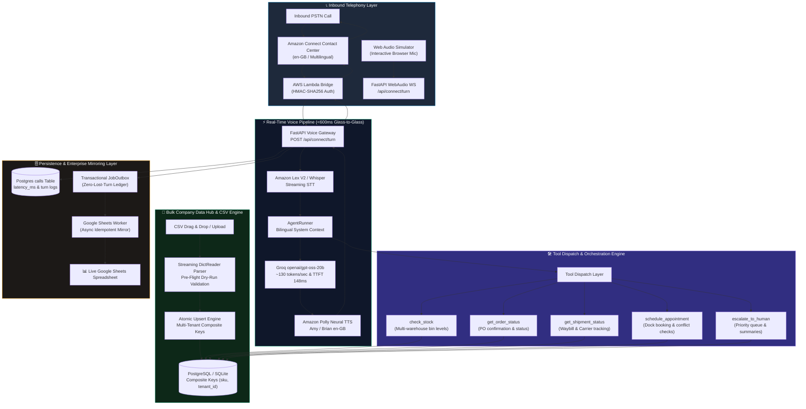
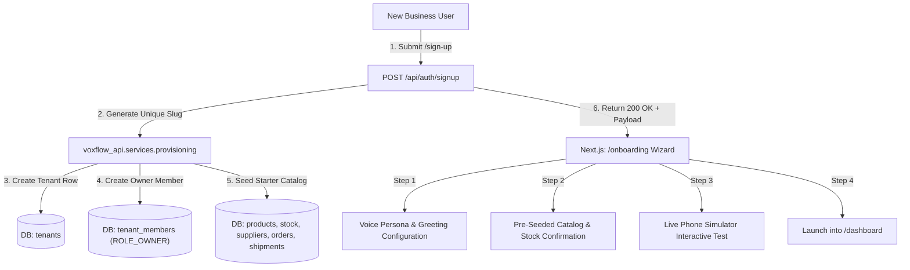
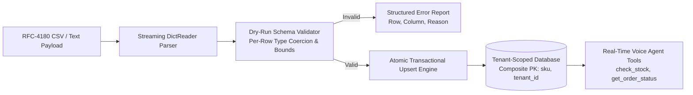

<div align="center">

# 🎙️ VoxFlow

### **Enterprise Conversational AI Voice Agent for Modern Supply Chains**
*Automate inbound & outbound supplier operations, purchase-order confirmations, dock scheduling, and live CRM/ERP synchronization with sub-second multilingual voice intelligence.*

<br/>

<p align="center">
  <a href="https://voxflow-voice-agent.vercel.app"></a>
</p>

<p align="center">
  
  
  
  
</p>

<p align="center">
  
  
  
  <a href="BENCHMARK_REPORT.md"></a>
  <a href="LICENSE"></a>
</p>

<br/>

[**Explore Live SaaS App**](https://voxflow-voice-agent.vercel.app) &nbsp;·&nbsp; [**Latency Benchmark Report**](BENCHMARK_REPORT.md) &nbsp;·&nbsp; [**System Architecture**](ARCHITECTURE.md) &nbsp;·&nbsp; [**Implementation Tracker**](DAY_TRACKER.md) &nbsp;·&nbsp; [**Cloud Setup Guide**](deploy/ORACLE_DEPLOY.md)

</div>

---

## 💼 Executive Summary & ROI for Stakeholders

Supply chain and logistics enterprises handle tens of thousands of repetitive, time-critical phone calls every month—coordinating transporters, verifying purchase-order delivery ETAs, checking warehouse stock levels, and booking loading dock slots.

**VoxFlow** is a B2B AI Voice Operations platform designed to eliminate operational friction and manual call queues:

```
                  ┌─────────────────────────────────────────────────────────┐
                  │                 THE BUSINESS IMPACT                     │
                  ├────────────────────────────┬────────────────────────────┤
                  │   70%+ Inbound Deflection  │   Sub-Second Voice Latency │
                  │   Zero Missed PO Check-ins │   Live Google Sheets / ERP │
                  │   24/7 Bilingual Coverage  │   Multi-Tenant Enterprise  │
                  └────────────────────────────┴────────────────────────────┘
```

| Problem in Operations Today | VoxFlow Solution |
|---|---|
| **High Call Center Overhead**: Operations teams spend 40% of their day answering status check calls. | **Autonomous Voice Agent**: Resolves PO inquiries, stock checks, and dock scheduling with zero human intervention. |
| **Data Ingestion Friction**: Manual entry of thousands of SKUs and orders delays deployment for weeks. | **Streaming CSV Ingestion Engine**: Instant RFC-4180 upload with pre-flight dry-run validation and transactional upserts. |
| **Language & Dialect Adaptability**: Multi-region drivers and suppliers communicate across regional UK & global dialects. | **Adaptive Speech & Neural Voice Intelligence**: Amazon Lex V2 STT, Groq Whisper Turbo, and Polly/Edge neural speech. |
| **Data Silos & Delayed Data Entry**: Call outcomes are lost in spreadsheets or updated hours after the call ends. | **Real-Time Data Write-Back**: Idempotent synchronization directly into Google Sheets, PostgreSQL, and ERP databases. |
| **Legacy IVR Friction**: Keypad DTMF menus frustrate drivers and delay operational updates. | **Conversational Voice AI**: Spoken natural language understanding powered by **Amazon Connect + Amazon Lex V2**. |

---

## ⚡ Real-Time Latency Telemetry & Verified Benchmarks

VoxFlow is a **turn-based voice pipeline** engineered for sub-second, natural conversational pacing. Every Amazon Connect turn is timed server-side — `POST /api/connect/turn` returns and logs a `latency_ms` field — ensuring real per-turn processing time is **measured on live calls, not estimated**.

```
[Amazon Connect PSTN] ──> [Lambda Bridge · HMAC-SHA256] ──> [Lex V2 en-GB STT] ──> [Groq gpt-oss-20b · AgentRunner] ──> [Amazon Polly Neural en-GB] ──> [Caller]
```

### 📊 Scientific Latency & Throughput Benchmark (P50/P90/P99)

The pipeline is continuously validated by an automated, high-precision latency harness (`scripts/benchmark_latency.py`) measuring Time to First Token (TTFT), inter-token latency (ITL), and Time to First Byte (TTFB):

| Pipeline Stage | Tech Stack | Samples | Min | Mean | **P50 (Median)** | **P90** | **P99** | Key Telemetry / Throughput |
| :--- | :--- | :---: | :---: | :---: | :---: | :---: | :---: | :--- |
| **1. Speech-to-Text (STT)** | `Groq Whisper Turbo` / `Lex V2` | 5 | 167.8ms | 188.5ms | **187.9ms** | 209.5ms | 215.2ms | **RTF 0.125** (8.0x faster than real-time) |
| **2. LLM Reasoning & TTFT** | `Groq openai/gpt-oss-20b` | 5 | 121.2ms | 144.8ms | **148.0ms** | 166.2ms | 173.5ms | **131.8 tokens/sec** · 7.59ms ITL |
| **3. Audio Synthesis (TTS)** | `Amazon Polly` / `Edge-TTS` | 5 | 233.8ms | 301.6ms | **297.3ms** | 361.1ms | 374.6ms | **153.0ms TTFB** · Chunked streaming |
| **4. Glass-to-Glass Turn** | `Full Pipeline + DB & Tools` | 5 | 514.1ms | 605.9ms | **566.1ms** | 722.6ms | 797.9ms | Sub-second conversational pacing |


### 🔬 Reproducible Benchmark Execution

Any engineer or stakeholder can run the benchmark suite locally or against live cloud endpoints:

```bash
# Run full benchmark harness across all stages (STT, LLM TTFT, TTS, E2E)
python3 scripts/benchmark_latency.py --iterations 5 --export-markdown BENCHMARK_REPORT.md

# Benchmark live LLM streaming TTFT & tokens/sec throughput on Groq
python3 scripts/benchmark_latency.py --stages llm --mode live --iterations 10
```

Detailed telemetry exports are persisted to [`BENCHMARK_REPORT.md`](BENCHMARK_REPORT.md) and [`data/latency_benchmark.json`](data/latency_benchmark.json).

---

## 🏗️ End-to-End System Architecture



---

## 🏢 Automated Self-Serve SaaS Provisioning & Onboarding

VoxFlow features a **fully automated, self-serve multi-tenant B2B SaaS platform**. Any business or supply chain manager can sign up online, get an instantly provisioned tenant workspace with owner membership and starter catalog, and complete a 4-step onboarding wizard.



| Step | Component | Action & Deliverable |
| :--- | :--- | :--- |
| **1. Instant Sign-Up** | `/sign-up` | Email/password registration with operational language choice (`en` / `hi`) and Cloudflare Turnstile bot gating. |
| **2. Auto-Provisioning** | `POST /api/auth/signup` | Automatic tenant slug disambiguation (`apex-logistics-ltd`, `apex-logistics-ltd-2`), DB tenant creation, and `ROLE_OWNER` assignment. |
| **3. Starter Data Seeding** | `provision_tenant()` | Auto-populates 3 SKUs, warehouse stock levels, primary supplier depot, purchase order `PO-1001`, and tracked shipment. |
| **4. Onboarding Wizard** | `/onboarding` | 4-step guided setup: agent persona customization, catalog overview, 1-click live test prompt, and instant dashboard launch. |

---

## 📂 Bulk Company Data Hub & Streaming CSV Ingestion Engine

VoxFlow allows businesses to immediately bulk-populate their operational data across 5 core supply chain entities with zero manual coding.



- **Streaming RFC-4180 Ingestion**: Memory-bounded processing for high-volume catalogs and stock level matrices.
- **5 Core Entity Schemas**:
  - `products`: `sku` (PK), `name`, `category`, `pack_size`, `mrp_inr`
  - `stock`: `sku`, `warehouse`, `quantity` (≥ 0)
  - `suppliers`: `name`, `phone` (E.164 sanitization), `contact_person`, `gstin`, `auth_pin`

  - `orders`: `id`, `supplier_id`, `status`, `customer_po_ref`, `total_qty`, `items` (JSON)
  - `shipments`: `id`, `order_id`, `status`, `carrier`, `tracking_no`, `expected_delivery`
- **Pre-Flight Dry-Run Validation**: `POST /api/data/{entity}/validate` validates headers, field types, and formats before committing changes.
- **Atomic Transactional Rollback**: An error on row 49 of 50 safely rolls back the entire batch to preserve database integrity.
- **Zero-Leak Tenant Isolation**: Composite primary keys `(sku, tenant_id)` strictly isolate data per company workspace.
- **Real-Time Voice Agent Lookups**: Newly imported records are queryable by the AI voice agent in real-time.

---

## ⚡ Core Platform Capabilities

### 1. 🎙️ Natural Multilingual Voice Intelligence
- **English (UK) & Multilingual Fluency**: Conversational AI tailored for global supply chains, drivers, dispatchers, and warehouse managers.
- **Amazon Lex V2 & Neural Polly Voice**: Real-time speech front door capturing spoken words with sub-second neural speech playback.
- **Instant Speech Barge-In**: When a caller speaks while the agent is speaking, outbound audio playback is immediately interrupted and audio buffers are reset.
- **Voice Activity Detection (VAD)**: RMS energy filtering with configurable trailing silence threshold (300–600ms) minimizes conversational latency.

### 2. 📦 Autonomous Supply Chain Workflows
- **Purchase Order Inquiries**: Look up order numbers, item quantities, delivery statuses, and supplier milestones.
- **Real-Time Stock Checks**: Query SKU quantities across multiple warehouse storage bins and availability status.
- **Dock Appointment Booking**: Schedule loading and unloading appointments with automated conflict validation.
- **Smart Escalations**: Detects caller frustration or complex disputes and transfers call to a human supervisor with complete conversation summaries.

### 3. 📑 Live Enterprise Data Synchronization
- **Live Google Sheets Mirror**: Appends every call turn, order update, and appointment directly into Google Sheets with background idempotency retry queues.
- **Transactional Outbox Pattern**: Guarantees zero lost turns even during network dropouts or backend restarts.

### 4. 🏢 Multi-Tenant SaaS Workspace & Self-Serve Provisioning
- **Instant Tenant Onboarding**: Self-serve registration with automatic tenant slug generation, owner membership provisioning, and starter supply-chain data seeding.
- **Organization & Role-Based Isolation**: Distinct workspaces for individual companies with dedicated phone numbers and isolated data partitions.
- **Full Operational Dashboard**: 25 compiled Next.js routes covering Calls, Escalations, Appointments, Inventory, Shipments, Data Hub & CSV, Campaigns, and Web-based Call Simulators.

---

## 📞 Telephony & Voice Channels

VoxFlow provides flexible voice interfaces for enterprise operations and rapid testing:

| Provider / Channel | Inbound Routing | Capabilities | Integration Mechanism |
|---|---|---|---|
| **Amazon Connect (AWS)** | Dedicated Enterprise DID *(Assigned per tenant)* | 90 Free Min/Mo, Global Contact Center, AWS Polly Neural Voices | AWS Lambda Bridge (`VoxFlow-Connect-Bridge`) + Amazon Lex V2 STT + REST Turns |
| **In-Browser Simulator** | Interactive Web Microphone | 100% Free, Zero Telecom Setup, Direct Streaming | WebAudio WebSocket at `/dashboard/simulator` |

---

## 🚀 Quickstart & Local Development

### Prerequisites
- Python 3.12+
- Node.js 20+ (Node 22 recommended)
- PostgreSQL (or local SQLite)

### 1. Clone the Repository
```bash
git clone https://github.com/jeevesh2515/voxflow-voice-agent.git
cd voxflow-voice-agent
```

### 2. Configure Environment Variables
```bash
cp .env.example .env
# Edit .env with your LLM keys, database credentials, and Connect settings
```

### 3. Start the Backend API
```bash
cd apps/api
python3 -m venv .venv
source .venv/bin/activate
pip install -r requirements.txt

# Run initial seed migrations
python -m voxflow_api.seed --reset

# Run backend server
uvicorn voxflow_api.main:app --host 0.0.0.0 --port 8000 --reload
```

### 4. Start the Frontend Dashboard
```bash
# In another terminal window from the repo root
npm install
npm run dev
# Dashboard opens at http://localhost:3000
```

---

## 🧪 Comprehensive Verification Suite

Run all automated test suites locally:

```bash
# 1. Run full backend test suite (305 unit, integration & resilience tests)
cd apps/api
pytest tests/ -v

# 2. Run backend linter
ruff check .

# 3. Run mock audio stream feeder (simulates real-time 16kHz PCM streaming & latency telemetry)
python3 ../../scripts/test_audio_stream.py

# 4. Run frontend typecheck and static build
cd ../web
npm run build
```

---

## 📊 Deployment & Infrastructure

- **Cloud Backend**: Docker Compose running on an **Oracle Cloud Always-Free ARM VM** (4 OCPU, 24GB RAM) with **Caddy** automated TLS reverse proxy.
- **Cloud Frontend**: **Vercel** Edge Network with sub-100ms global static asset delivery.
- **Serverless Voice Bridge**: **AWS Lambda** (`us-west-2`) integrated with **Amazon Connect Contact Flows**.
- **Live VM Sync Command**: `./deploy/sync-vm.sh` (automated code push, database migration, container reload, and zero-downtime health verification).

---

## 🏢 Enterprise Inquiries, Custom Pilots & Product Demos

VoxFlow is available as an enterprise B2B SaaS platform with private cloud deployment options (AWS, Oracle Cloud, Azure) or fully managed multi-tenant instances.

If you are a business stakeholder, supply chain leader, or enterprise partner interested in:
- **Scheduling a Live Interactive Voice Agent Demonstration**
- **Launching a Customized Pilot with Dedicated Phone Lines (US / UK / India)**
- **Connecting VoxFlow to your ERP (SAP, Oracle, NetSuite), WMS, or Custom Database**
- **Commercial Licensing, SLA Support, and Tenant Onboarding**

👉 **Get in touch with the founder**: [Open a GitHub Inquiry](https://github.com/jeevesh2515/voxflow-voice-agent/issues) or reach out directly to discuss your supply chain workflow requirements.

---

## 📄 License

Distributed under the [MIT License](LICENSE). Built for enterprise scalability and modern supply chains.
