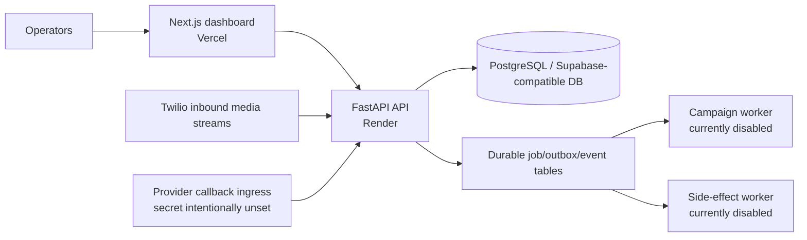

# VoxFlow Setup and Deployment Guide

**Last updated:** 2026-08-20
**Current deployment:** FastAPI API on Render and Next.js dashboard on Vercel.
**Campaign and side-effect safety:** `DURABLE_CAMPAIGN_WORKER_ENABLED=false` and `DURABLE_SIDE_EFFECTS_WORKER_ENABLED=false` must remain set in production unless a separately approved controlled pilot is being operated.

## 1. Deployment topology



| Component | Production URL | Role |
|---|---|---|
| Web dashboard | <https://voxflow-voice-agent.vercel.app> | Next.js operator UI. |
| API | <https://voxflow-voice-agent.onrender.com> | FastAPI control plane, inbound voice, jobs read models. |
| API health | <https://voxflow-voice-agent.onrender.com/api/health> | General API availability. |
| Job health | <https://voxflow-voice-agent.onrender.com/api/jobs/health?tenant_id=varun> | Staged rollout/job visibility verification. |

## 2. Local development

### Prerequisites

- Node.js 22 or later
- Python 3.12
- npm or pnpm
- SQLite for default local tests; a PostgreSQL-compatible database only when exercising production migration paths

### API

```bash
cd apps/api
python3.12 -m venv .venv
source .venv/bin/activate
pip install -r requirements.txt
python -m voxflow_api.seed --reset
uvicorn voxflow_api.main:app --reload --port 8000
```

### Web dashboard

```bash
cd apps/web
npm install
cp .env.example .env.local
npm run dev
```

Set `NEXT_PUBLIC_API_URL=http://localhost:8000` in the web environment for local API calls. The dashboard is available at `http://localhost:3000`.

## 3. Database migrations

SQLite tests initialize from SQLAlchemy metadata. Production database upgrades use the repository’s ordered migration files. The durable campaign migration sequence is:

```text
migrations/003_durable_job_ledger.sql
migrations/004_outbox_relay_state.sql
migrations/005_campaign_policy_controls.sql
migrations/006_provider_callback_lifecycle.sql
migrations/007_dial_sandbox_callback_adapter.sql
migrations/008_typed_durable_side_effect_jobs.sql
```

Run migrations through an approved PostgreSQL migration procedure. Do not run a campaign worker merely to validate migration success. Use API health, test suites, and safe job-health reads instead.

## 4. Render backend deployment

Render is the backend runtime because the API hosts HTTP routes, WebSocket/inbound voice behavior, and future separately deployed workers. Configure the service from the repository’s deployment configuration and provide environment values through Render’s secret manager.

| Environment variable | Purpose | Production guidance |
|---|---|---|
| `DATABASE_URL` | PostgreSQL connection string | Use a managed production database secret. |
| `API_CORS_ORIGINS` | Allowed browser origins | Include the Vercel production origin. |
| `PUBLIC_BASE_URL` | Public API base URL used by telephony/webhook paths | Use the Render API base URL or approved public ingress. |
| Telephony/LLM credentials | Provider integrations | Store only in Render secrets; never commit them. |
| `DURABLE_CAMPAIGN_WORKER_ENABLED` | Global campaign worker kill switch | **Keep `false` in production.** |
| `DURABLE_CAMPAIGN_CANARY_TENANTS` | Future canary admission list | Keep empty until explicit approval. |
| `DURABLE_CAMPAIGN_DRY_RUN` | Provider-free campaign-worker path | Keep enabled for staging/dry-run evidence. |
| `PROVIDER_CALLBACK_VALIDATE_SIGNATURE` | Enables HMAC/timestamp verification for normalized callbacks | **Keep `true`.** |
| `PROVIDER_CALLBACK_SHARED_SECRET` | Callback ingress HMAC secret | **Leave unset until a provider-specific Day 33 sandbox adapter is approved.** An unset secret fails closed. |
| `PROVIDER_CALLBACK_MAX_AGE_SECONDS` | Maximum signed callback age | Retain the default `300` unless an approved provider contract requires another bounded value. |
| `DIAL_CALLBACK_ADAPTER_ENABLED` | Day 33 Dial-specific ingress switch | **Keep `false` in production.** It returns 503 before body parsing or persistence. |
| `DIAL_CALLBACK_SANDBOX_MODE` | Prevents non-sandbox adapter operation | **Keep `true`.** The endpoint requires this value even when deliberately enabled for fixtures. |
| `DIAL_CALLBACK_ALLOWED_TENANTS` | Stored-operation tenant application allow-list | Keep empty. A verified adapter event cannot apply without a deliberate sandbox tenant admission. |
| `DIAL_CALLBACK_SIGNING_SECRETS` | Current/previous Dial webhook HMAC secret overlap | **Leave unset.** Never place secrets in logs, documents, browser configuration, or version control. |
| `DIAL_CALLBACK_MAX_AGE_SECONDS` | Dial webhook replay-age bound | Retain `300` unless a reviewed provider contract requires another bounded value. |
| `DURABLE_SIDE_EFFECTS_WORKER_ENABLED` | Independent operational side-effect worker hard stop | **Keep `false` in production.** The API must never claim Sheets/email/CRM/notification/recording jobs. |
| `DURABLE_SIDE_EFFECTS_DRY_RUN` | Provider/integration-free side-effect worker path | **Keep `true`** until a tenant-specific approval and dry-run evidence exist. |
| `DURABLE_SIDE_EFFECTS_ALLOWED_TENANTS` | Future side-effect worker admission list | Keep empty. A worker cannot build without an explicit tenant. |
| `DURABLE_SIDE_EFFECTS_MAX_CONCURRENCY` | Maximum concurrent operational side effects per worker | Retain `1` for staged/dry-run validation. |

After deployment, verify only safe endpoints:

```bash
curl -fsS https://voxflow-voice-agent.onrender.com/api/health
curl -fsS 'https://voxflow-voice-agent.onrender.com/api/jobs/health?tenant_id=varun'
curl -fsS 'https://voxflow-voice-agent.onrender.com/api/campaign-policies/varun'
curl -sS -o /dev/null -w '%{http_code}\n' -X POST 'https://voxflow-voice-agent.onrender.com/api/provider-callbacks/events' -H 'Content-Type: application/json' -d '{}'
curl -sS -o /dev/null -w '%{http_code}\n' -X POST 'https://voxflow-voice-agent.onrender.com/api/provider-callbacks/dial/events' -H 'Content-Type: application/json' -d '{}'
curl -fsS 'https://voxflow-voice-agent.onrender.com/api/analytics/overview?tenant_id=varun&days=7'
# Confirm the JSON contains durable_side_effects with activation_mode=staged,
# dry_run=true, tenant_allowed=false, and no unplanned intents/errors.
```

Expected Day 34 posture is `activation_mode: "staged"`, `canary_allowed: false`, campaign dry-run true, an unconfigured tenant policy, generic normalized callback ingress returning `503`, and Dial ingress returning `503 dial_callback_adapter_disabled` before body parsing. The analytics response must include `dial_sandbox_adapter` and `durable_side_effects`; the latter must show `activation_mode="staged"`, `dry_run=true`, `tenant_allowed=false`, and zero unplanned intent/error counts in an untouched deployment. These checks are intentionally malformed/read-only; they must never be replaced with a live Dial callback, configured secret, provider ping, Sheets write, Gmail fetch, CRM post, notification, recording retrieval, or side-effect-worker enablement during deployment verification.

## 5. Vercel frontend deployment

Deploy `apps/web` as the Next.js project root. Configure the frontend with the Render API endpoint.

| Variable | Value |
|---|---|
| `NEXT_PUBLIC_API_URL` | `https://voxflow-voice-agent.onrender.com` |
| `NEXT_PUBLIC_WS_URL` | `wss://voxflow-voice-agent.onrender.com` when the configured backend endpoint supports WebSocket traffic |
| Supabase public settings | Use approved public client values only; never a service-role key |

After Vercel reports success, verify the public and protected routes without invoking campaign actions:

```bash
curl -I https://voxflow-voice-agent.vercel.app/
curl -I https://voxflow-voice-agent.vercel.app/about
curl -I https://voxflow-voice-agent.vercel.app/pricing
curl -I https://voxflow-voice-agent.vercel.app/dashboard/campaigns
curl -I https://voxflow-voice-agent.vercel.app/dashboard/analytics
```

Public routes should return `200`. A session-free dashboard request should redirect to `/sign-in`. In an authenticated browser, verify the campaign page renders **Safe Staging** and **No Inline Dialling**, then verify the analytics page renders the read-only **Provider Lifecycle**, **Dial Sandbox Adapter**, and **Durable Side Effects** panels. In the safe default deployment the adapter panel must display **STAGED**, **BLOCKED**, and zero audit/failure totals; the Day 34 panel must show **STAGED**, zero intents/errors, tenant **BLOCKED**, and dry-run protection. Neither panel can expose a provider/integration configuration or trigger an action.

## 6. Quality gate before a delivery

```bash
# Backend
cd apps/api
.venv/bin/ruff check voxflow_api tests
.venv/bin/pytest -q

# Frontend, from repository root
npm run lint --workspace=apps/web
npm run build --workspace=apps/web
```

A delivery is not complete until the relevant GitHub CI workflow succeeds and the Vercel deployment status for the same commit succeeds.

## 7. Campaign and side-effect worker operating rule

Workers are intentionally separated from the API request path. Neither worker may be started manually on a developer machine against production credentials, and neither may be enabled merely because the dashboard exposes a campaign or side-effect read model. FastAPI must not start the legacy Sheets retry or email scan loops.

Before a future internal canary, confirm all of the following:

1. The global worker switch is intentionally changed through an approved release.
2. Exactly one internal tenant is in the allow-list.
3. The tenant policy is valid and enabled.
4. The E.164 test target has consent and no opt-out.
5. Daily limit and in-flight capacity are one.
6. Provider sandbox or dry-run has passed, including signed callback duplicate/reorder/unknown-call drills.
7. An operator can monitor jobs, policy decisions, provider operations, and rollback.

Before a controlled pilot, apply the same rule to operational side effects: a worker must have a written tenant approval, an explicit tenant allow-list, dry-run evidence, a named operator, integration-specific credential review, and rollback ownership. Day 35 adds the final one-tenant/fixed-cohort/operating-hours/human-escalation/scorecard gate; readiness is not activation.

## 8. Historical self-hosted instructions

Older Oracle Cloud, DuckDNS, Caddy, and Docker-compose notes were superseded by the current Render/Vercel deployment path. Keep any environment-specific runbook outside this document and label it with its runtime/date; do not present it as the production default.

## References

- [README](README.md)
- [Architecture](ARCHITECTURE.md)
- [Security audit](security_audit.md)
- [Current phase plan](PHASES.md)
- [Render configuration](render.yaml)
- [Vercel configuration](vercel.json)
