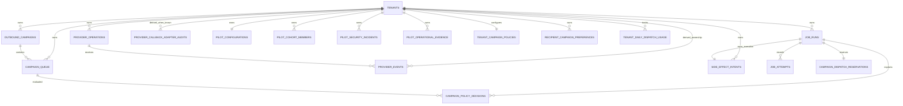

# VoxFlow Database Schema Reference

**Last updated:** 2026-08-26
**Authoritative implementation:** `apps/api/voxflow_api/db.py` and the ordered SQL files in `migrations/`.
**Purpose of this document:** Explain tenant boundaries, durable execution, policy controls, provider callback evidence, typed side-effect intent evidence, Day 35 controlled-pilot readiness, and Day 36 operational-evidence records. It is not a substitute for applying production migrations.

## 1. Schema and migration authority

Local SQLite development/tests create the SQLAlchemy metadata. Production PostgreSQL changes must be applied through the checked-in migration sequence. For durable campaign delivery, apply migrations in this order:

```text
003_durable_job_ledger.sql
004_outbox_relay_state.sql
005_campaign_policy_controls.sql
006_provider_callback_lifecycle.sql
007_dial_sandbox_callback_adapter.sql
008_typed_durable_side_effect_jobs.sql
009_controlled_pilot_readiness.sql
010_pilot_operations_evidence.sql
014_telephony_provider.sql
015_call_latency.sql
016_telephony_routing_and_caller_pins.sql
017_product_tenant_composite_key.sql
```

The initial tenant/core schema (`000_base_schema.sql`) and prior feature migrations must already be present. Do not copy partial DDL from this document into a production database; use the migration files so indexes and constraints remain aligned with code.

## 2. Tenant isolation model

Every operational, campaign, durable-job, provider-operation, and policy record is owned by `tenant_id` or is reached from a tenant-owned parent. API handlers filter by tenant. The dashboard passes the active tenant for campaign, queue, and health reads. PostgreSQL deployments must additionally enforce row-level security for tenant-scoped tables according to the production access model.

| Rule | Meaning |
|---|---|
| Tenant owns data | No campaign target, job, preference, audit decision, or provider operation may be queried/mutated across tenant boundaries. |
| Tenant derives from trusted context | API/session context or stored provider operation determines tenant identity; provider callback request fields are never trusted to select a tenant. |
| Tenant-safe reads | Job health, recent jobs, campaign queue, and policy-decision APIs return only the active/declared tenant’s data. |
| Append-only evidence | Job attempts and policy decisions preserve operational facts even after job/target state changes. |

## 3. Core operational tables

| Table | Tenant key | Role |
|---|---|---|
| `tenants` | Primary tenant record | Workspace/company identity and baseline ownership. |
| `suppliers` | `tenant_id` | Supplier/customer contacts, caller-verification metadata, and operational directory. |
| `products`, `stock` | `tenant_id` | Tenant product catalog and warehouse stock. |
| `orders`, `shipments` | `tenant_id` | Purchase-order and logistics workflow records. |
| `calls` | `tenant_id` | Voice transcript, outcome, verification, and resolution evidence. |
| `appointments` | `tenant_id` | Dock/meeting scheduling records. |
| `communication_logs` | `tenant_id` | Email/SMS/WhatsApp-related operational communication history. |
| `tenant_phone_numbers` | `tenant_id` | Globally unique exact E.164 DID ownership plus provider, active state, verification mode, route language, and created/updated timestamps. |
| `outbound_campaigns` | `tenant_id` | Campaign configuration and aggregate target/call counters. |
| `campaign_queue` | `tenant_id` | Individual campaign targets, status, call ID, retry time, and transcript summary. |

### Telephony routing and caller-PIN fields

| Table/field | Rule |
|---|---|
| `tenant_phone_numbers.phone_number` | Global primary key in E.164 form; cross-tenant reassignment is rejected. |
| `tenant_phone_numbers.provider` | Stored as `connect`, `twilio`, or `telnyx` for forward-compatible schema storage, but only `connect` (Amazon Connect) has a live inbound resolution route today; the owner-facing API only accepts `connect` when creating or updating a line. Inbound lookup matches provider and active state exactly. |
| `verification_mode` | `standard` or `enhanced`; controls whether protected reads also require a verified PIN. |
| `route_language` | `tenant_default`, `en`, or `hi`; selected when the call session starts. |
| `suppliers.auth_pin_hash` | Salted PBKDF2-HMAC-SHA256 verifier; never returned through application APIs. |
| `suppliers.auth_pin` | Nullable legacy compatibility field, cleared after owner reset or successful migration-on-verification. |
| `suppliers.pin_updated_at` | Latest set/reset/import/migration timestamp shown only as posture metadata. |
| `suppliers.pin_failed_attempts` | Persistent failed-PIN counter that survives across sessions/calls; resets to 0 on success or owner reset. Independent of the per-call session's own short-lived attempt counter. |
| `suppliers.pin_locked_until` | When set and in the future, `verify_pin` fails closed regardless of the submitted PIN. Engaged after 10 persistent failures for a 15-minute window; cleared on success or owner reset. |

## 4. Durable execution tables (Days 25–29)

| Table | Key columns and constraints | Purpose |
|---|---|---|
| `job_runs` | `id`, `tenant_id`, `job_type`, payload, status, priority, schedule/next-run, lease owner/expiry, attempt/max attempts, idempotency key, error fields | The durable unit of work. States include `ready`, `running`, `retry_scheduled`, `succeeded`, `cancelled`, and `dead_lettered`. |
| `job_outbox` | Tenant-owned event aggregate, payload, publish/lease state, idempotency key | Prevents loss between a committed domain change and job publication. |
| `job_attempts` | Job ID, worker, started/finished timestamps, outcome, error evidence | Immutable execution/claim history. `policy_deferred` is an intentional business wait, not an unclassified failure. |
| `provider_operations` | Tenant, provider, operation type, idempotency key, request hash, provider ID, durable status | Owns the external provider side-effect boundary. |
| `provider_events` | Tenant-derived operation reference, provider/event/call IDs, type, occurrence time, payload hash, redacted normalized facts, application/anomaly status | Immutable signed-callback history; unique `(provider, provider_event_id)` enforces delivery idempotency. |
| `provider_callback_quarantines` | Provider event/call metadata, payload hash, reason, timestamps; intentionally no tenant ID | Safe record for a trusted callback that cannot resolve an existing provider operation. |
| `provider_callback_adapter_audits` | Optional derived tenant, provider event ID/type, payload hash, verification/normalization/application dispositions, reason, timestamp; unique `(provider, provider_event_id, payload_hash)` | Redacted immutable receipt for the Day 33 provider-specific adapter. It records safe verification and rollout-gate outcomes without storing raw bodies, headers, signatures, secrets, phone numbers, or transcripts. |
| `side_effect_intents` | Tenant, one durable `job_id`, typed effect, trusted aggregate type/ID, tenant idempotency key, SHA-256 identifier hash, bounded status/result, timestamps; unique `(tenant_id, idempotency_key)` and unique `job_id` | Day 34 durable owner for an external operation. It references a locally stored trusted aggregate rather than duplicating raw Sheets rows, email content, notification bodies, recording bytes, webhook payloads, signatures, or credentials. |

The durable job repository uses conditional state transitions that verify the current `running` state, lease owner, and unexpired lease. This prevents a stale worker from completing, cancelling, or retrying a job it no longer owns.

## 5. Day 30 tenant policy tables

| Table | Key fields | Purpose |
|---|---|---|
| `tenant_campaign_policies` | `tenant_id`, `timezone_name`, `calling_window_start/end`, `daily_call_limit`, `max_in_flight`, `enabled` | Explicit tenant dispatch policy. A missing/disabled/invalid policy fails closed. |
| `recipient_campaign_preferences` | `(tenant_id, recipient_phone)` unique pair, consent status/purpose, opt-out, source | Current recipient permission state for outbound operational campaigns. |
| `tenant_daily_dispatch_usage` | `(tenant_id, local_date)` unique pair, reserved calls, active dispatches | Atomic tenant-local daily quota/capacity record. |
| `campaign_dispatch_reservations` | `job_id` unique, tenant, local date, `active/released/settled` state | One capacity reservation per dispatch job; prevents double consumption. |
| `campaign_policy_decisions` | Tenant, job, campaign, queue target, decision, reason code, evidence, next eligibility time | Append-only policy audit evidence. |

### Policy-linked statuses

| Layer | Status/outcome | Meaning |
|---|---|---|
| Job | `cancelled` | Terminal policy decision; not a retryable infrastructure failure. |
| Job attempt | `policy_deferred` | A deliberate wait until a policy-selected time. |
| Queue target | `cancelled` | The target must not reach a provider. |
| Reservation | `released` | No provider request was issued; budget and capacity were released. |
| Reservation | `settled` | Dry-run or terminal provider outcome completed; active capacity released while the day’s call decision remains accounted for. |
| Policy decision | `allowed`, `deferred`, `cancelled` | Immutable record of every dispatch-policy evaluation. |

## 6. Day 32 provider callback evidence

`provider_events.tenant_id` is derived only after the service resolves an existing `provider_operations` row by `(provider, provider_id)`. The callback transport never supplies an authoritative tenant, campaign, queue, or job reference. Unknown calls are inserted only into `provider_callback_quarantines`, which deliberately has no tenant relationship.

| Callback evidence field | Data handling rule |
|---|---|
| `provider_event_id` and `provider_call_id` | Used for idempotency and stored-operation lookup; not shown in the tenant analytics aggregate. |
| `payload_hash` | Retained for forensic equality checks; raw callback payload is not stored in the event ledger. |
| `normalized_payload_json` | Contains only normalized outcome facts needed for reconciliation. It must not contain secrets, transcript content, or raw provider payload. |
| `apply_status` and `anomaly_code` | Used for operator lifecycle aggregate and alerting; does not by itself authorize a retry or re-dial. |

A terminal callback may finalize the job associated with the durable provider operation even if that job is waiting in a callback-pending retry state. The transition is guarded by the stored operation identity, immutable event deduplication, and terminal-state checks; late callbacks cannot reopen a completed, cancelled, or dead-lettered job.

## 7. Day 33 adapter audit evidence

`provider_callback_adapter_audits` is intentionally distinct from `provider_events`. It contains one provider-adapter receipt per event/payload-hash identity, whereas `provider_events` exists only when the generic Day 32 lifecycle service receives a normalized observation. A valid Dial event can therefore be audited as `blocked_tenant`, `acknowledged`, or `rejected` without any campaign, queue, job, capacity, or provider-operation mutation.

| Field | Data-handling rule |
|---|---|
| `tenant_id` | Null until and unless the normalized callback resolves exactly one stored outbound operation. It is derived from storage, never callback input. |
| `verification_status` | `verified` or `rejected`; used for tenant-safe monitoring only where a tenant was safely derived. |
| `normalization_status` | `normalized`, `ignored`, `ping`, or `not_normalized`; never contains a raw provider payload. |
| `application_status` | `applied`, `duplicate`, `blocked_tenant`, `acknowledged`, `rejected`, or a Day 32 lifecycle disposition. |
| `payload_hash` | Cryptographic equality evidence only. It is not a recoverable callback body. |
| `reason_code` | Bounded operational code such as `invalid_dial_signature` or `dial_callback_tenant_not_allowed`; no raw exception detail. |

## 8. Day 34 side-effect intent evidence

A side-effect intent is created in the same transaction as its business or audit record, its `job_runs` row, and its `job_outbox` row. The job payload contains only `side_effect_intent_id`. The worker re-loads the tenant-owned intent and aggregate under a valid lease before it can perform an approved operation.

| Field | Data-handling rule |
|---|---|
| `effect_type` | Must be a predefined handler type such as `sheets.call_outcome.append`, `email.summarization.scan`, `crm.webhook.sync`, `notification.dispatch`, or `recording.retrieve`; arbitrary task execution is prohibited. |
| `aggregate_type` / `aggregate_id` | Trusted reference to an existing local row, used to reconstruct an operation payload only in a separately gated worker. |
| `idempotency_key` | Tenant-scoped durable ownership boundary; repeated enqueue returns the same job/intent. |
| `payload_hash` | Hash of bounded identifiers, not recoverable business content. |
| `status` / `result_code` / `result_json` | Bounded state and result evidence only. Never store raw integration output, phone number, message content, recording bytes, secret, callback header, or provider payload. |
| `job_id` | One-to-one durable job ownership. Job attempts retain worker execution history; the intent supplies operation-specific evidence. |

The `side_effect_intents` table does not authorize execution by itself. `DURABLE_SIDE_EFFECTS_WORKER_ENABLED`, an explicit tenant allow-list, and dry-run mode are independent operational controls. In the Day 34 deployed posture the worker is disabled; the worker does not claim integration work.

## 9. Day 35 pilot-readiness evidence

| Table | Key fields | Data-handling and operational role |
|---|---|---|
| `pilot_configurations` | One row per tenant: pilot/version/status, cohort ID/count, IANA window, daily/in-flight micro-capacity, expiry, named primary/backup owners, acknowledgement SLO, metric version, approver/timestamps | A versioned readiness contract. It contains no recipient phone or escalation channel. It does not enable a worker or authorize a call by itself. |
| `pilot_cohort_members` | Tenant, cohort, SHA-256 recipient hash, consent-evidence reference, reviewed status/timestamp; unique `(tenant_id, cohort_id, recipient_hash)` | Fixed cohort matching without exposing E.164 values through the dashboard or readiness API. An approved-member count must equal `cohort_size` before admission succeeds. |
| `pilot_security_incidents` | Tenant, pilot ID, bounded category/severity/status/summary, detection/resolution time | Measures confirmed findings for the frozen security metric. It is not proof that no unidentified incident exists. |

The Day 35 policy gate requires an explicit environment tenant allow-list, `PilotConfiguration.status=approved`, an unexpired configuration, named primary/backup coverage and approver, micro-capacity, a fully reviewed cohort count, and an exact recipient hash match. Its scorecard and rollback-preview routes are read-only. The database-only rollback utility refuses while the campaign worker is enabled or any scoped job has a live lease.

## 10. Day 36 pilot-operational evidence

| Table | Key fields | Data-handling and operational role |
|---|---|---|
| `pilot_operational_evidence` | Tenant, pilot ID/version, evidence kind/key, bounded decision/reason, aggregate snapshot, recorder, timestamp; unique `(tenant_id, pilot_id, pilot_version, evidence_kind, evidence_key)` | Immutable redacted receipt for preflight, hold-point, pause, or rollback review. The JSON snapshot contains only aggregate counts, booleans, state labels, timestamps, and trusted configuration facts—never recipient numbers, transcripts, raw callbacks, signatures, credentials, or job payloads. |

When `PILOT_OPERATIONS_EVIDENCE_ENFORCED=true`, the Day 35 policy gate also requires fresh current-tenant-local-day evidence for the exact pilot version with decision `continue_same_cohort`. Missing, stale, paused, blocked, rollback-requested, or version-mismatched evidence cancels admission. A receipt never enables a worker and `expansion_permitted` is always false.

## 11. Relationship map



## 12. Data-handling requirements

1. New operational tables must remain tenant scoped and have production migration coverage.
2. Tenant policy/audit endpoint responses must redact raw evidence data unless a scoped administrator workflow explicitly needs it.
3. The provider operation idempotency key must be stable for the job’s intended provider request.
4. Do not delete or overwrite attempt/policy evidence in normal execution paths.
5. Expensive or external work must occur after the durable state is committed and must reconcile back through tenant-owned records.
6. Provider callbacks must validate freshness and a provider-specific signature before they are normalized or persisted; a missing secret must fail closed.
7. Unknown provider IDs must quarantine without creating a tenant, campaign, queue, job, or provider operation.
8. Provider-adapter audit rows must persist only hashes, bounded event metadata, and bounded dispositions; never raw bodies, signature headers, secrets, phone numbers, or transcript content.
9. A provider-specific adapter must be explicitly enabled in sandbox mode, have a signing secret, and resolve an allow-listed stored-operation tenant before it may create a Day 32 lifecycle event.
10. Side-effect intents must retain only trusted aggregate identifiers, hashes, and bounded result facts; no job/intention ledger may copy raw external payloads, messages, recordings, credentials, or signature material.
11. A request, voice tool, callback, dashboard, or FastAPI lifespan process may persist a side-effect intent but must not execute the effect inline; only an independently feature-gated worker may do so.
12. Pilot cohort records must use stable recipient hashes and consent-evidence references; no dashboard/read-only API may return raw E.164 data from the cohort ledger.
13. A Day 35 readiness scorecard reports fixed formulas and observed values only; it must not imply an approval or activation.
14. Day 36 operational evidence must contain only aggregate/redacted state, be unique per pilot version/evidence key, and never itself grant expansion or execution permission.
15. Telephony settings APIs may return route policy, masked phone posture, and PIN timestamps only; plaintext PINs and hashes are prohibited.
16. Schema changes that affect telephony routing, caller verification, policy, consent, jobs, provider operations, provider events, side-effect intents, pilot readiness, or pilot operations require migration review, targeted tests, and a `schema.md` update.

## References

- `apps/api/voxflow_api/db.py`
- `apps/api/voxflow_api/jobs/repository.py`
- `apps/api/voxflow_api/jobs/campaign_policy.py`
- `migrations/003_durable_job_ledger.sql`
- `migrations/004_outbox_relay_state.sql`
- `migrations/005_campaign_policy_controls.sql`
- `migrations/006_provider_callback_lifecycle.sql`
- `migrations/007_dial_sandbox_callback_adapter.sql`
- `migrations/008_typed_durable_side_effect_jobs.sql`
- `migrations/009_controlled_pilot_readiness.sql`
- `migrations/010_pilot_operations_evidence.sql`
- `apps/api/voxflow_api/pilot_readiness.py`
- `apps/api/voxflow_api/pilot_operations.py`
- `apps/api/voxflow_api/jobs/side_effects.py`
